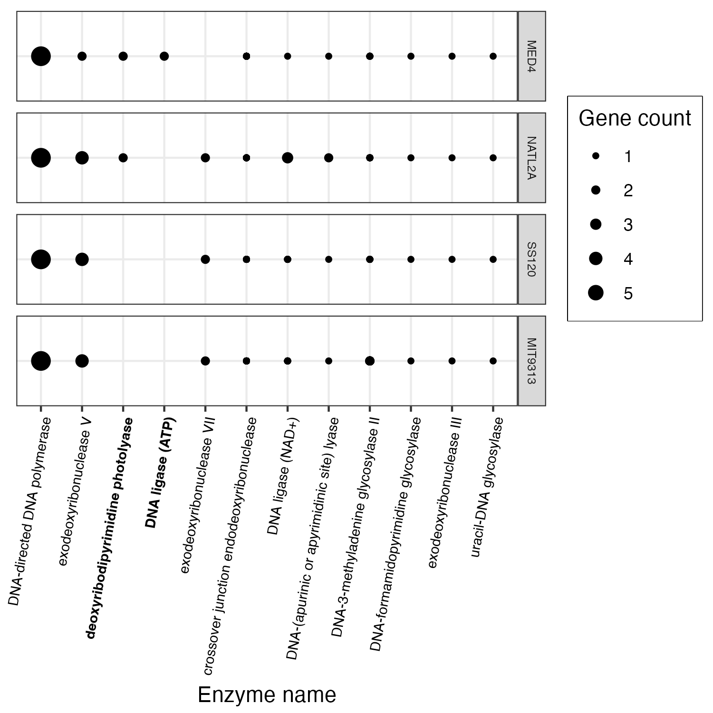
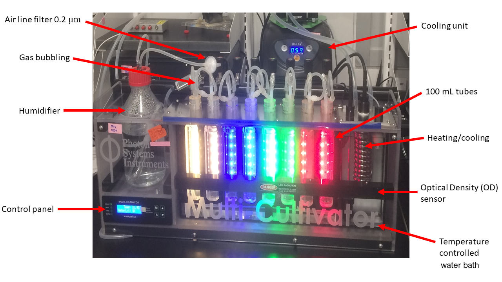
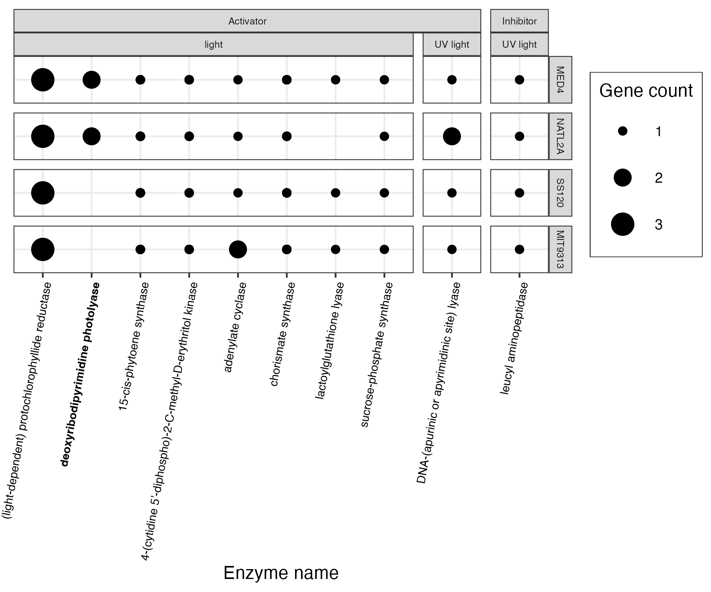

<style type="text/css">
p.caption {
  font-size: 12px;
}
</style>


# Abstract {.unnumbered}

*Prochlorococcus marinus*, the smallest picocyanobacterium, comprises
multiple clades with distinct niches across tropical and sub-tropical
oligotrophic ocean regions, including Oxygen Minimum Zones. Ocean
warming may open permissive temperatures in new, poleward photic
regimes, along with expanded Oxygen Minimum Zones. We used ocean protein
data [@saitoPeptidesTheirSpectral2018] to help guide testing of
*Prochlorococcus marinus* growth across a matrix of peak irradiances,
photoperiods, spectral bands and dissolved oxygen. MED4 from Clade HLI
requires greater than 4 h photoperiod, grows at 25 µmol O~2~ L^-1^ and
above, and exploits high cumulative diel photon doses, yet shows
accelerated growth when the cost of photoinactivation is lowered under
red, vs. blue, actinic light. MED4 relies upon an alternative oxidase to
balance electron transport, which may exclude it from growth under our
lowest 2.5 µmol O~2~ L^-1^ condition. SS120 from Clade LLII/III is
restricted to low light under full 250 µmol O~2~ L^-1^, shows expanded
light exploitation under 25 µmol O~2~ L^-1^, but is excluded from growth
under 2.5 µmol O~2~ L^-1^. Intermediate oxygen suppresses the cost of
PSII photoinactivation, and enzymatic production of H~2~O~2~ in SS120,
which has limited genomic capacity for PSII and DNA repair. MIT9313 from
Clade LLIV is restricted to low blue irradiance under 250 µmol O~2~
L^-1^, but exploits much higher irradiance under red light, or under
lower O~2~ concentrations, conditions which slow photoinactivation of
PSII and production of reactive oxygen species.

\newpage

# Introduction {.unnumbered}

## *Prochlorococcus marinus* diversity {.unnumbered}

*Prochlorococcus*, a genus of Cyanobacteria, is the smallest known
photosynthetic prokaryote, with cell diameters ranging from 0.5 to 0.7
µm [@chisholmProchlorococcusMarinusNov1992]. Despite small cell size,
*P. marinus* contribute 13 to 48% of net primary production in
oligotrophic oceans, corresponding to about 30% of global oxygen
production [@partenskyProchlorococcusMarinePhotosynthetic1999].
*Prochlorococcus marinus* growth is currently limited to between
latitudes of 40°N to 40°S in open ocean waters, from surface to 300 m
depth, thus spanning 3 orders of magnitudes of light irradiance
[@partenskyProchlorococcusMarinePhotosynthetic1999;
@chisholmProchlorococcusMarinusNov1992].

*Prochlorococcus marinus* comprises many strains, organized into clades,
defined by 16S-23S intergenic transcribed ribosomal sequence signatures
[@rocapGenomeDivergenceTwo2003]. The clades inhabit distinct ecological
niches [@moorePhysiologyMolecularPhylogeny1998], originally defined as
High-Light (HL) or Low-Light (LL). Only 5 out of 12 known
*Prochlorococcus* genetic clades have cultured representatives to date;
HLI, HLII, LLI, LLII/III and LIV
[@billerProchlorococcusStructureFunction2015]. Current niches of *P.
marinus* strains span ocean water columns
[@veldhuisVerticalDistributionPigment1990;
@chisholmNovelFreelivingProchlorophyte1988;
@partenskyProchlorococcusMarinePhotosynthetic1999] and extend into
regions with low dissolved oxygen concentrations
[@partenskyProchlorococcusAdvantagesLimits2010;
@goerickeNovelNicheProchlorococcus2000;
@lavinNovelLineagesProchlorococcus2010;
@ulloaCyanobacteriumProchlorococcusHas2021;
@garcia-robledoCrypticOxygenCycling2017].

Low-Light clades thrive in deeper ocean waters, extending beyond 200 m
in depth [@partenskyProchlorococcusMarinePhotosynthetic1999], where only
\~1% of the surface irradiance penetrates, primarily in the blue (450
nm) to green (520 nm) spectral range
[@holtropVibrationalModesWater2021]. Clade LLI includes cultured strain
NATL2A, which prefers moderate irradiances typical of between 30 and 100
m depth. Clades LLII and LLIII, including cultured strain SS120, are
grouped together as the second oldest phylogenetic lineage diversifying
in the *P. marinus* radiation, with an affinity for low light. Clade
LLIV, including cultured strain MIT9313, falls near the base of the
*Prochlorococcus* radiation, and is characterized by preference for low
light, typical of depths from 120 m to 200 m
[@partenskyProchlorococcusMarinePhotosynthetic1999]. LLIV members are,
as yet, the only cultured strains to have been found in Oxygen Minimum
Zones (OMZ). Some, as yet, uncultured *P. marinus* strains in clades LLV
and LLVI also thrive in OMZ of the subtropical Atlantic and Pacific
Oceans, where dissolved oxygen concentrations [O~2~] can be less than 20
µM [@ulloaCyanobacteriumProchlorococcusHas2021;
@lavinNovelLineagesProchlorococcus2010;
@goerickeNovelNicheProchlorococcus2000;
@garcia-robledoCrypticOxygenCycling2017;
@johnsonEnergeticsGrowthKinetics1999]. *Prochlorococcus marinus* LL
ecotypes may indeed dominate the phytoplankton within OMZ
[@lavinNovelLineagesProchlorococcus2010;
@ulloaCyanobacteriumProchlorococcusHas2021;
@partenskyProchlorococcusAdvantagesLimits2010], where they may be net
O~2~ consumers [@partenskyComparisonPhotosyntheticPerformances2018].

High-Light clades are more recently branching lineages, with reduced
genome sizes in comparison to LL clades. High-Light clades are typically
dominant picophytoplankters in near-surface, oligotrophic waters,
characterized by high light levels and subdivided into clades based on
iron adaptation [@johnsonNichePartitioningProchlorococcus2006;
@zinserInfluenceLightTemperature2007;
@kentParallelPhylogeographyProchlorococcus2019]. Clade HLI, represented
by cultured strain MED4, is adapted to high iron, and low temperatures,
and originated from 5 m depth in the Mediterranean Sea
[@partenskyProchlorococcusMarinePhotosynthetic1999]. Clade HLII, adapted
to high iron, and high temperatures, is the most abundant *P. marinus*
clade in the North Atlantic and North Pacific Oceans, often constituting
over 90% of the total population
[@partenskyProchlorococcusMarinePhotosynthetic1999], and are most
numerous around 50 m depth
[@partenskyProchlorococcusMarinePhotosynthetic1999]. Clade HLIII/IV is
adapted to low iron [@kentParallelPhylogeographyProchlorococcus2019;
@johnsonNichePartitioningProchlorococcus2006;
@zinserInfluenceLightTemperature2007].

*Prochlorococcus marinus* clades are nonetheless found in environments
beyond their optimal habitats. HL clades inhabit depths overlapping with
LL ecotypes [@westNichePartitioningProchlorococcusPopulations1999;
@zinserInfluenceLightTemperature2007;
@delmontLinkingPangenomesMetagenomes2018], while LL clades can occupy
regions in OMZ at depths shallower than 40 m
[@lavinNovelLineagesProchlorococcus2010], exploiting ambient light
levels above what LL clades were thought to tolerate.

## *Prochlorococcus* and changing niches {.unnumbered}

Our changing climate is rapidly altering conditions for these
specialized clades of marine picophytoplankton. Predictions indicate a
net global increase of *P. marinus* cell abundances of 29%
[@flombaumPresentFutureGlobal2013], along with poleward latitudinal
shifts of at least 10° in marine phytoplankton niches by the end of this
century [@bartonAnthropogenicClimateChange2016] in response to warming
waters, with increases in *P. marinus* of approximately 50% in the more
poleward regions of their distributions.

Near the equator, photoperiod remains nearly constant at the ocean
surface, approximately 12 hours (h) of daylight and 12 h of darkness
throughout the year. The effective length of the photoperiod does,
however, attenuate with depth as dawn and dusk light at depth drops
below levels needed for biological processes. As *P. marinus*
potentially expands its temperature-permissive niches poleward into
temperate regions [@flombaumPresentFutureGlobal2013;
@bartonAnthropogenicClimateChange2016], it will encounter more
pronounced seasonal variations in photoperiod regimes both at surface
and at depth, with potentially complex effects upon viable growth niches
[@liDiatomGrowthResponses2017;
@prezelinDielPeriodicityPhytoplankton1992]. For example, Vaulot *et al*.
@vaulotGrowthProchlorococcusPhotosynthetic1995 showed that
*Prochlorococcus* replication of DNA occurs in the afternoon, while cell
division occurs at night. To our knowledge, no study has as yet
addressed *P. marinus* growth responses in relation to a range of
photoperiods.

Climate change is also rapidly changing ocean chemistry. By the end of
this century, surface ocean pH is projected to decline by 0.1 to 0.4 due
to projected increases in carbon dioxide concentrations
[@garcia-sotoOverviewOceanClimate2021]. Moreover, substantial changes in
the global water cycle, leading to extensive changes in worldwide
precipitation patterns, are affecting ocean salinity levels on a global
scale, and ice melts due to rising temperatures are impacting salinity
levels in the Arctic and Northwest Atlantic oceans
[@leeRecognizingSalinityThreats2022]. Increasing sea temperatures are
also causing decreases in [O~2~] across global oceans
[@matearLongtermChangesDissolved2003], particularly toward the poles
[@helmObservedDecreasesOxygen2011]. Warmer ocean waters decrease oxygen
solubility at the surface, and increase stratification, which in turn
decreases oxygen mixing downwards by ocean currents
[@garcia-sotoOverviewOceanClimate2021]. Models predict that OMZ in the
Pacific and Indian Oceans are expanding
[@garcia-sotoOverviewOceanClimate2021;
@buseckeDivergingFatesPacific2022], although the cores of the OMZ, where
the oxygen levels are lowest, may actually contract
[@buseckeDivergingFatesPacific2022].

We used the OceansMap Protein Portal (OPP;
<https://proteinportal.whoi.edu/>) [@saitoDevelopmentOceanProtein2021]
to analyze the distribution of proteins from clades of *P. marinus* in
samples taken across a range of [O~2~] and depth, which in turn
correlates to depth attenuated peak light at the site of sampling. In parallel we
analyzed the growth and physiological responses of representative
strains from three clades of *P. marinus* under a matrix of [O~2~],
light levels, spectral waveband ranges, and photoperiods, to approximate
eco-physiological conditions representative of current and hypothetical
future ocean zones. *Prochlorococcus marinus* MED4, a clade HLI strain,
was isolated near the ocean surface (5m depth) of the Mediterranean Sea
where [O~2~] is near saturation, light levels are high and spectral bias
from full solar irradiance is minimal. *Prochlorococcus marinus* SS120,
a clade LLII/III strain, was isolated from the Sargasso Sea at a depth
of 120 m, while *P. marinus* MIT9313, a clade LLIV strain, was isolated
from the North Atlantic Gulf Stream at a depth of 135 m
[@moorePhotophysiologyMarineCyanobacterium1999]. At these depths, light
attenuation and spectral shifts occur, resulting in low blue light,
while [O~2~] varies from near-surface saturation levels to decreased
concentrations, but does not necessarily decrease systematically with
depth [@billheimerOxygenSeasonalityUtilization2021].

Photosynthetic organisms absorb light energy within the
Photosynthetically Active Radiation (PAR) range, 350 to 700 nm, for
photosynthesis [@morelAvailableUsableStored1978]. Photosynthetically
Usable Radiation (PUR) represents the fraction of PAR that can be
absorbed by the pigments of a given photosynthetic organism
[@morelAvailableUsableStored1978], taking into account the specific
spectral wavebands these pigments absorb. *Prochlorococcus marinus* Pcb
light-harvesting complexes show an absorption maxima of 442 nm for
divinyl chlorophyll *a* and 478 nm for divinyl chlorophyll *b*
[@goerickePigmentsProchlorococcusMarinus1992] allowing *P. marinus* to
efficiently harvest blue light in the 400 nm to 500 nm range
[@morelAvailableUsableStored1978] corresponding to blue spectral
wavelengths prevailing in deep ocean habitats
[@holtropVibrationalModesWater2021]. In *P. marinus* small cell
diameters, from 0.5 to 0.7 µm [@chisholmProchlorococcusMarinusNov1992],
and simple cell structures, minimize the complication of pigment package
effect or intracellular self-shading
[@morelProchlorococcusSynechococcusComparative1993] contributing to
efficient optical absorption, although photosynthetic efficiency may
vary among clades [@hessPhotosyntheticApparatusProchlorococcus2001;
@moorePhotophysiologyMarineCyanobacterium1999].

Given the different spectral light regimes typical of the niches of
different ecotypes, expressing growth rates in terms of cumulative diel
PUR might simplify different photoperiods, spectral bands, and PAR
levels into a common parameter, making growth response comparisons
across strains and different oxygen levels more accessible. We aimed to
detect whether growth responses are driven simply by cumulative diel
PUR, or whether specific photoperiods, spectral bands or PAR levels have
independent, albeit interacting, effects on growth. We therefore
analyzed growth rates in terms of cumulative diel PUR.

We discuss our findings in relation to analyses of genomic sequences
[@changBRENDAELIXIRCore2021] across clades of *P. marinus*, showing that
differences in the expression and presence of genes encoding protein
turnover, oxygen-dependent enzymes, and DNA repair enzymes, can explain
the differential growth responses of strains under the matrix of light
and [O~2~] conditions of this study.

\newpage

# Materials and methods {.unnumbered}

## MetaProteomics {.unnumbered}

The OceansMap Protein Portal is an open access online data repository
(Woods Hole Oceanographic Institute, WHOI) of mass spectroscopy data on
marine microbial peptides, sampled from various depths and locations
worldwide [@saitoDevelopmentOceanProtein2021]. We screened a subset of
the OPP for proteins annotated as from *Prochlorococcus* strains, to
identify differential strategies employed by strains living at varying
depths and oxygen levels within the marine water column. We focused on
proteins mediating photosynthesis and protein metabolism from depths of
20 to 200 m below the ocean surface. The samples for metaproteomic
analyses were collected from 7 locations in the tropical North Pacific
ocean along 150 W from 18 N of the equator between October 1, 2011 and
October 25, 2011 during the voyage of the R/V Kilo Moana MetZyme cruise
[@rollingdecktorepositoryCruiseKM1128RV2015]; original datasets in the
Biological and Chemical Oceanography Data Management Office (BCO-DMO)
repository [@saitoPeptidesTheirSpectral2018]. Oxygen concentration
levels at the location of sampling were recorded. The methodology for
sample collection and peptide analysis are described by Saito *et al*.
[@saitoMultipleNutrientStresses2014; @saitoNeedlesBlueSea2015].

## MetaProteomics bioinformatic analyses {.unnumbered}

Metaproteomic datasets were obtained from the KM1128 entry in the
BCO-DMO database [@saitoPeptidesTheirSpectral2018] accessed via the OPP
in June 2019. Datasets contained: i) Peptide sequences and sample
identification (ID) number; ii) Sample ID number, station, depth in
meters below the surface the sample was collected at, best-hit BLASTP
protein and species annotation and the corresponding Uniprot Entry
number for the identified proteins; iii) Sample station depth and
[O~2~].\
The depth and [O~2~] were joined to peptide sequence and BLASTP
annotations by ID number, depth and station using *tidyverse* package
[@R-tidyverse] running under R v4.1.3 and RStudio v2023.06.0 [@RStudio].
The resulting merged dataset was filtered for those *Prochlorococcus*
peptides, detected from 0 to 300 m below the surface, annotated as a
subunit of *Prochlorococcus* chlorophyll binding proteins (Pcb);
Photosystem II (PSII); Cytochrome b~6~f (Cytb~6~f); Photosystem I (PSI);
NADPH Dehydrogenase (NDH); Plastoquinol Terminal Oxidase (PTOX);
Plastocyanin (PC); Ferredoxin (Fd); Ribulose-1,5-bisphosphate oxygenase
(RUBISCO); Adenosine triphosphate (ATP) Synthase; FtsH proteases (FtsH)
or ribosomes. Detected peptides were re-annotated for consistency and
labelled, where feasible, according to strain, clade, subunit and
protein complex. Full protein sequences corresponding to detected
proteins were obtained from UniProt (<https://www.uniprot.org/>) and
analyzed in Molecular Evolution and Genetic Analyses X (MEGAX) software
(<https://www.megasoftware.net/>). Sequences for proteins for each of
the thirteen *Prochlorococcus* strains identified in the dataset were
aligned with MUSCLE using UPGMA cluster method and a lambda of 24 with a
-2.9 gap open penalty and 1.20 hydrophobicity multiplier. Overall mean
pairwise distance between protein sequences was determined using
bootstrap variance estimation methods. Maximum likelihood phylogenetic
trees were assembled using 1000 bootstrap replications with a 95% site
coverage cut off. *Prochlorococcus* FtsH isoform identities, and
functions, were inferred by sequence comparisons to the characterized
four isoforms of FtsH protease of *Synechocystis* sp. PCC6803
[@bonisteelStrainSpecificDifferences2018]. Data for each strain was
plotted against depth and [O~2~] and sampling station.

When assessing the presence of a particular protein complex at a
sampling location, all peptides belonging to all subunits of the complex
were included to give the greatest number of data points. As this data
was acquired on a discovery mission rather than through targeted peptide
approaches, it is difficult to discern accuracies of strain assignment
annotations, particularly as the proteins of interest in this study are
highly conserved across strains. We are, however, confident in clade
classifications for each protein examined. The data is also limited
because a peptide sequence was not determined unless there was already a
known spectrum for that peptide in the SEQUEST database, hence some
peptides of interest may not be identifiable. Furthermore, a peptide
must be detected above a certain threshold abundance in order to be
considered an accurate ‘hit’.

## *Prochlorococcus* culturing and experimental design {.unnumbered}

*Prochlorococcus* remain challenging to culture, as their reduced
genomes – the smallest of any known oxyphototroph – render them
partially dependent upon mutualistic heterotrophic bacteria to detoxify
reactive oxygen species [@morrisFacilitationRobustGrowth2008;
@morrisDependenceCyanobacteriumProchlorococcus2011]. MED4, SS120 and
MIT9313 have been successfully cultured in laboratories
[@mooreComparativePhysiologySynechococcus1995;
@mooreCulturingMarineCyanobacterium2007], and used to show that ecotypic
classifications correspond to biochemical differences among strains
[@bonisteelStrainSpecificDifferences2018]. Three xenic cultures of *P.
marinus* were obtained from Bigelow Labs, NCMA Maine, USA. MED4
(CCMP1986) is from High-Light adapted (HLI) clade; SS120 (CCMP1375) is
from Low-Light adapted (LLII/III) clade; and MIT9313 (CCMP2773) is from
Low-Light adapted (LLIV) clade. Cultures were maintained in incubators
set to 22°C with an on/off light/dark cycle of 12 h. The PAR level for
maintenance cultures reflected PAR in the source niche of the ecotype;
MED4, of 160 µmol photons m^-2^ s^-1^ with illumination from STANDARD
Products Inc. Cool White F24T5/41K/8/HO/PS/G5/STD, 24 watts, fluorescent
bulbs; SS120 and MIT9313 at 30 µmol photons m^-2^ s^-1^ with
illumination from Philips Cool White F14T5/841 Alto, 14 watts,
fluorescent bulbs. To maintain active growth all strains were
transferred weekly with 1 in 5 dilutions with Pro99 media
[@mooreCulturingMarineCyanobacterium2007] prepared with autoclaved
artificial seawater [@bergesEvolutionArtificialSeawater2001].

Controlled growth experiments were performed using MCMIX-OD or MC1000-OD
PSI Multicultivators (Figure \@ref(fig:LabeledMC); PSI, Drásov, Czech
Republic). Each multicultivator individually controls 8 tubes at a
common temperature of 22°C. Each tube containing 70 mL of Pro99 media
was inoculated with 10 mL of growing maintenance culture. In a factorial
matrix design, each tube was then subject to an individual combination
of sinusoidal photoperiod (4, 8, 12, 16 h); reaching a peak PAR (30, 90,
180 µmol photons m^-2^ s^-1^), with defined spectral bandwidth (White
LED, 660 nm, 450 nm). [O~2~] levels (2.5 µM, 25 µM, 250 µM) were imposed
by bubbling tubes with varying ratios of air and Nitrogen (N~2~), with
consistent 0.05% of Carbon Dioxide (CO~2~) gas, delivered through a 0.2
μm sterile microfilter via a G400 gas mixing system (Qubit Systems Inc.,
Kingston, Ontario, Canada). [O~2~] *in situ* was verified using oxygen
optodes (PyroScience, Germany) inserted into tubes for real-time
measurements, with a temperature probe in the bath of the bioreactor to
correct [O~2~] measures for temperature fluctuations. In addition, the
Pyroscience software corrected [O~2~] based on the salinity of the media
(32 ppt). The flow rate of the gas mixture was controlled, but
variations in bubbling speed, PAR and culture density affected the
[O~2~] achieved in each tube. A low [O~2~] of 0.5 µM - 5 µM (reported as
2.5 µM hereafter), was achieved by sparging with a gas mixture
containing 99.95% N~2~ and 0.05% CO~2~. An intermediate [O~2~] of 10 -
25 µM (reported hereafter as 25 µM) was achieved by sparging with a gas
mixture containing 98.95% N~2~, 0.05% CO~2~ and 1% O~2~. A high O~2~ of
200 µM - 280 µM (reported hereafter as 250 µM) was achieved by sparging
with lab air (78% N~2~, 21% O~2~, 1% Ar and 0.05% CO~2~).

The full crossing of all factor levels would yield 4 x 3 x 3 x 3 = 108
treatments, x 3 strains for 324 possible combinations. Consistent
absence of growth of some strains under some levels of photoperiod, PAR,
or [O~2~] meant we completed 268 growth factor treatment combinations.

*In situ* measurements of Optical Density (OD) 680 nm, a proxy for cell
suspension density, cell size dependent scatter and cell chlorophyll
content; and OD 720 nm, a proxy for cell suspension density and cell
size dependent scatter, were recorded every 5 minutes over least 8 to 14
days, depending on the duration of the lag phase, if any.

Peak PAR of 180, 90 or 30 µmol photons m^-2^ s^-1^, and spectral wavebands
(white LED full spectrum, 660 nm (red light), and 450 nm (blue light))
were chosen to approximate light levels and spectral colours spanning
the vertical ocean water column, from near-surface to the lower euphotic
zone depths. Photoperiods were chosen to approximate diel cycles
characteristic of current and hypothetical future niches of *P.
marinus*; 16 h represents temperate (45°N) summer at the ocean surface;
12 h for equatorial (0°N) ocean surface or temperate (45°N) spring and
fall ocean surface or temperate (45°N) summer at deeper ocean depths; 8
h for temperate (45°N) winter at the surface or at temperate (45°N)
spring and fall at depth and equatorial (0°N) deep ocean depths; and 4 h
for temperate (45°N) winter or deep ocean depths during temperate (45°N)
spring and fall.

## Growth rate analysis {.unnumbered}

Data files (.csv) saved from the Multicultivator software were imported
into R-Studio for data management [@R-tidyverse], growth rate
calculations, comparisons of model fits
[@harrisonPhotosynthesisirradianceRelationshipsPolar1986], and
visualization. The chlorophyll proxy optical density (OD~680~ - OD~720~;
ΔOD) was used to determine the chlorophyll specific growth rate (µ,
d^-1^) for each treatment combination. We first used a rolling mean from
the R package *`zoo`* [@R-zoo] to calculate the average ΔOD data over a
1-hour window to lower the influence of outlier points and remove data
points collected during post stationary phase, when applicable. We used
the Levenberg-Marquardt algorithm
[@bellaviaLevenbergMarquardtMethod2018] modification of the non-linear
least squares, using the R package *`minpack.lm`* [@R-minpack.lm], to
fit a logistic equation (Equation \@ref(eq:GrowthRate)); where ΔOD~max~
is maximum ΔOD, ΔOD~min~ is minimum ΔOD, t is time duration over the
growth trajectory.

```{=tex}
\begin{equation}
  µ = \frac{ΔOD_{max} × ΔOD_{min} × exp^{(µ × t)}}{ΔOD_{max} + (ΔOD_{min} × exp^{((µ × t) - 1)})}
  (\#eq:GrowthRate)
\end{equation}
```

Figure \@ref(fig:deltaODLogGrowthPlot) is an example of chlorophyll
specific growth estimates fitted from the high resolution ΔOD
measurements for each tube in a Multicultivator. The residuals of the
logistic growth curve fit are shown. The imposed PAR (µmol photons m^-2^ s^-1^) are plotted for each tube and illustrates the applied photoperiod (h) regimes.

A Generalized Additive Model (GAM) [@woodGeneralizedAdditiveModels2017]
was applied to the relation of chlorophyll-specific µ, d^-1^ to
photoperiod and PAR level, for each growth [O~2~] level, and for the
blue and red wavebands for growth, for each *P. marinus* strain in this
study. The R package *`mgcv`* [@R-mgcv] was used to model the growth
rate with smoothing terms and indicate the 90, 50 and 10% quantiles for
growth rate across the levels of factors. Only growth rate estimates for
which the amplitude of standard error was smaller than 30% of the fitted
growth rate were included in the GAM. Our priority was the effects of
ecologically relevant blue light on growth trends. We also included GAM
analyses of growth responses to red light, which is not
ecophysiologically relevant, but which might prove mechanistically
informative [@murphyPhotoinactivationPhotosystemII2017].

## Estimation of photosynthetically usable radiation {.unnumbered}

To estimate the Photosynthetic Usable Radiation (PUR), a proxy of
incident photons that can be absorbed by the cells, for each *P. marinus* ecotype, 
the imposed Photosynthetic Active Radiation (PAR) was
first determined using the reported delivery of sinusoidal diel PAR
regimes by the Multicultivators, point validated using a LI-250 quantum
sensor (LI-COR Inc.,Lincoln, NE, USA). An emission profile from 400 nm
to 700 nm of each coloured LED light of the MCMIX-OD Multicultivator and
the white LED light of the MC1000-OD Multicultivator was obtained using
a Jaz spectrometer (Ocean Optics, Inc.,Dunedin, FL, USA) equipped with a
fiber optic cable, HH2 FiberOpticJmp (Part number A901073, Malvern
Panalytical Ltd, Malvern, UK). Each LED spectrum was then normalized to
its emission maximum. An *in-vivo* whole cell absorbance spectrum for
each *P. marinus* strain under each spectral growth condition was
obtained using the Olis 14 UV/VIS Clarity Spectrophotometer (Olis Inc.,
Bogart, GA, USA) to scan across range of λ = 350 nm to 750 nm at 1 nm
intervals. The path length of the internally reflective cavity of the
Olis spectrophotometer was corrected to a 1 cm path length using the
Javorfi correction method
[@javorfiQuantitativeSpectrophotometryUsing2006] on PRO 99 media
subtracted whole cell absorbance spectra. The blank-corrected whole cell
absorbance spectra were normalized to the absorbance maximum of divinyl
chlorophyll *a* (Chl *a*~2~), determined for each spectra, falling
between 400 nm and 460 nm.

An integrated weighting equation \@ref(eq:WeightedPUR)
[@morelAvailableUsableStored1978] was used to determine the weighted PUR
spectrum P(λ); where A(λ) is the blank subtracted, Chl *a*~2~ peak
normalized whole cell absorbance spectrum for each *P. marinus* ecotype,
over 400 nm to 700 nm, A(λ); and E(λ) is the peak normalized emission
spectrum of the imposed LED growth light, over 400 nm to 700 nm.

```{=tex}
\begin{equation}
  P(λ) = A(λ) × E(λ) 
  (\#eq:WeightedPUR)
\end{equation}
```
PUR levels (µmol photons m^-2^ s^-1^) were calculated from
imposed PAR (µmol photons m^-2^ s^-1^) levels using the equation
\@ref(eq:PUR) from [@morelAvailableUsableStored1978]; where P(λ) is the
weighted PUR absorbance spectrum from equation \@ref(eq:WeightedPUR),
E(λ) is the imposed growth light emission spectrum from equation
\@ref(eq:WeightedPUR) and PAR is the imposed peak light level (µmol
photons m^-2^ s^-1^). Figure (\@ref(fig:PurParPlot)) shows the
calculated peak PUR (µmol photons m^-2^ d^-1^) vs. imposed
peak PAR (µmol photons m^-2^ s^-1^) for each strain and each spectral
waveband (nm).

```{=tex}
\begin{equation}
  PUR = \frac{\int_{400}^{700} P(λ)}{\int_{400}^{700} E(λ)} × PAR
  (\#eq:PUR)
\end{equation}
```
The applied photoperiods were delivered using the sinusoidal circadian
light function of the PSI Multicultivator to simulate light exposure
approximating sun rise through to sunset. The area under the sinusoidal
curves is equivalent to the area of a triangular photoregime of
equivalent photoperiod (Campbell, unpub), therefore the equation to
determine the cumulative diel PUR (µmol photons m^-2^ d^-1^) is one half
of the base (photoperiod) multiplied by the height (PUR) (Equation
\@ref(eq:SumPURDay)); where PUR is the usable light (µmol photons m^-2^ s^-1^) calculated from
equation \@ref(eq:PUR), 3600 is the time conversion from seconds to hour and photoperiod is the imposed
photoperiod (h).

```{=tex}
\begin{equation}
  Cumulative~diel~PUR = \frac{PUR × 3600 × Photoperiod}{2}
  (\#eq:SumPURDay)
\end{equation}
```
Figure \@ref(fig:OverlayPlots) provide visual representations of PUR,
the black solid line and shaded area, in relation to the imposed PAR,
the dotted line, under each imposed spectral wavebands for *P. marinus*
MED4 (A,B,C), SS120 (D,E,F) and MIT9313 (G,H,I). Figure
(\@ref(fig:PurParPlot)) shows the relationship between calculated PUR
vs. imposed PAR for each *P. marinus* and each spectral waveband.

We performed one-way ANOVA to examine statistical differences between
Harrison and Platt
[@harrisonPhotosynthesisirradianceRelationshipsPolar1986] 4 parameter
model fit to 660 nm (red light) and 450 nm (blue light) growth data for
each combination of strain and [O~2~]. We also performed one-way ANOVA
to examine statistical differences between Harrison and Platt
[@harrisonPhotosynthesisirradianceRelationshipsPolar1986] 4 parameter
model fit to each photoperiod (4 h, 8 h, 12 h, 16 h) and pooled
photoperiod growth data for each combination of strain and [O~2~].
Photoperiod growth data that showed complete growth inhibition for each
combination of strain, [O~2~] and imposed spectral waveband were omitted
from the pooled photoperiod model. Statistical differences were
determined at p \< 0.05.

\newpage

<div class="figure">

<p class="caption">(\#fig:PurParPlot)**Peak Photosynthetically Usable Radiation (PUR; µmol photons m^-2^ s^-1^) vs. peak Photosynthetically Active Radiation (PAR; µmol photons m^-2^ s^-1^).** The correlation between PAR, plotted on the x-axis and PUR, plotted on the y-axis, are coloured for each imposed spectral waveband; 450 nm (blue circles), 660 nm (red circles) and white LED (black circles). The grey dashed line represents a hypothetical one to one correlation. **A.** is *Prochlorococcus marinus* MED4. **B.** is *Prochlorococcus marinus* SS120. **C.** is *Prochlorococcus marinus* MIT9313.</p>
</div>

\newpage

## *Prochlorococcus* comparative genomics {.unnumbered}

We filtered the dataset of Omar *et al*.
[@omarAnnotationGenesEncoding2023], for Enzyme Commission Numbers (EC
numbers), or Kegg Orthology Numbers (KO numbers) identified by BRENDA
[@changBRENDAELIXIRCore2021] as 'natural substrates' for O~2~; EC
numbers identified by BRENDA as being activated, or inhibited by light;
and EC numbers annotated by BioCyc [@karpBioCycCollectionMicrobial2019]
as corresponding to the Gene Ontology Term (<GO:0006281> - DNA repair),
in *P. marinus* strains (MED4, MIT9313, SS120, and NATL2A). We grouped
orthologs together by EC number and their KO number and determined the
occurrences of individual orthologs encoding each EC number, or KO
number when EC number was not available, in a given strain. We merged
the dataset with a list of enzyme Michaelis constant (K~m~) values from
other organisms, as K~m~ values from *Prochlorococcus* were only
available in the case of Ribulose bisphosphate carboxylase. Gene counts
for Flavodiirons were obtained from Allahverdiyeva *et al*.
[@allahverdiyevaCyanobacterialOxygenicPhotosynthesis2015], as they do
not have allocated EC numbers. A full list of enzymes and corresponding
EC and KO numbers can be found in Table
\@ref(tab:ProchlorococcusEnzymeTable).

\newpage

# Results and discussion {.unnumbered}

## Detection of *Prochlorococcus* proteins across O~2~ and light niches in the ocean {.unnumbered}

Proteins from 13 annotated strains of *P. marinus* were detected across
depths and oxygen concentrations in the ocean proteins data set
analyzed. We focused our analysis here on core photosynthetic protein
complexes, for clades HL, LLI, LLII/III and LLIV (Figure
\@ref(fig:CladeProchloroPhotosynthDepthO2) as a function of depth (a
proxy for light intensity) and measured [O~2~]. Photosynthetic complexes
from HLI (including strain MED4) were detected throughout the water
column, predominantly at high [O~2~]. The absence of proteins annotated
for the key ATP Synthase complex for Clade HLI, compared to annotated
detections of ATP Synthase across the other three clades suggests
limitations in the annotation process for highly conserved protein
sequences. Complexes from Clades LLI (including strain NATL2A) were also
present across the depth/light axes, with more representation at lower
[O\~2], and fewer near surface detections. Complexes from clade LLII/III
(ex. SS120) were also detected across the depth/light and [O~2~] ranges,
with more detections at deeper, darker depths. Clade LLIV (ex. MIT9313)
photosynthetic complexes were also were detected throughout the
depth/light and [O~2~], ranges, with the most frequent detections at
depth and at low [O~2~], compared to other strains.

\newpage

<div class="figure">

<p class="caption">(\#fig:CladeProchloroPhotosynthDepthO2)**Ocean detection of *Prochlorococcus marinus* photosynthesis complexes.** Protein detections (circles) are plotted vs. O~2~ (µM) (X-axis) and depth (m) (Y-axis) at sample origin. Rows separate data annotated as from *Prochlorococcus* clades: HLI (including *P. marinus* MED4, solid black circles), LLI (including *P. marinus* NATL2A, solid black circles), LLII/III (including *P. marinus* SS120, solid black circles) and LLIV (including *P. marinus* MIT9313, solid black circles). Columns show detections of proteins annotated as  Photosystem II (PSII), Cytochromeb6f complex (Cytb6f), Photosystem I (PSI), ATP Synthase or Ribulose-1,5-bisphosphate oxygenase carboxylase (RUBISCO). For comparison culture growth experimental conditions are indicated by horizontal grey lines for depths approximating peak Photosynthetically Active Radiation (PAR; µmol photons m^-2^ s^-1^); and vertical grey lines for imposed [O~2~] (µM). Data obtained from the Biological and Chemical Oceanography Data Management Office repository [@saitoPeptidesTheirSpectral2018].</p>
</div>

\newpage

## *Prochlorococcus marinus* growth responses to photoperiod, PAR, spectral band, and [O~2~] {.unnumbered}

Guided in part by the evidence of ocean distributions of proteins from
*Prochlorococcus* we set up a matrix of photoperiods, PAR, spectral
bands, and [O~2~] to approximate current, and potential future,
latitudinal, depth and seasonal niches for *Prochlorococcus* strains. As
mentioned, growth under red light could prove mechanistically
informative [@murphyPhotoinactivationPhotosystemII2017] to factors
limiting *Prochlorococcus* growth, we therefore included the red
spectral waveband even though it is not representative of
*Prochlorococcus* niches. Although *Prochlorococcus* is currently
limited to a narrow range of surface photoperiods, potential poleward
latitudinal expansions, in combination with attenuation of light with
depth, mean *Prochlorococcus* may potentially encounter a wide range of
photoperiods. Our growth rate determinations generally agree with those
from Moore *et al*. [@mooreComparativePhysiologySynechococcus1995], for
white LED and 250 µM O~2~, but our study is, to our knowledge, the first
to analyze the interactive growth responses of *Prochlorococcus* strains
to varying [O~2~], spectral wavebands and photoperiods.

*Prochlorococcus marinus* MED4, clade HLI, growth under 250 µM O~2~
increased with higher imposed PAR and longer photoperiods (Figure
\@ref(fig:MED4PAR)), across all spectral wavebands. No growth was
observed under any imposed conditions under a 4 h photoperiod. The
maximum growth rate (µ~max~) was
0.68
d^-1^ achieved under 180 µE blue light and 16 h photoperiod.

Similar to growth trends under 250 µM O~2~, MED4 maintained at 25 µM
O~2~ showed fastest growth when the photoperiod was 16 h for each
spectral waveband, across PAR levels (Figure \@ref(fig:MED4PAR)). The
µ~max~ was
0.65
d^-1^ (Table \@ref(tab:MaxGrowthTable)) achieved under 180 µmol photons
m^-2^ s^-1^ blue light and 16 h photoperiod. The 4 h photoperiod
experiments under white LED light were not performed as no growth was
achieved when grown under an 8 h photoperiod of white LED light.

MED4 did not grow when sparged to the lowest [O~2~] of 2.5 µM (Figure
\@ref(fig:MED4PAR)). 2.5 µM O~2~ growth experiments were not conducted
for 4 and 16 h photoperiods, as no reproducible growth occurred when
MED4 was exposed to 8 and 12 h photoperiods.

\newpage

<div class="figure">

<p class="caption">(\#fig:MED4PAR)**Chlorophyll specific growth rate (d^-1^) for *Prochlorococcus marinus* MED4 (High-Light (HLI) near surface clade) vs. photoperiod (h).** Rows separate data from levels of imposed dissolved O~2~ concentrations (250 µM, 25 µM and 2.5 µM). Columns separate data from 3 levels of peak imposed Photosynthetically Active Radiation (PAR; 30, 90 and 180 µmol photons m^-2^ s^-1^). Colours represent the imposed spectral waveband (nm). Large circles show mean or single determinations of growth rate from logistic curve fits; small circles show values for replicate determinations, if any: replicates often fall with larger circles.</p>
</div>

\newpage

The GAM model in Figure \@ref(fig:MED4GAM) summarizes MED4 growth
responses to red (A,B) or blue (C,D) peak PAR and photoperiod across 2
imposed oxygen concentrations. Under 250 µM O~2~ MED4 achieved fastest
growth rates above peak blue light of \~180 µmol photons m^-2^ s^-1^,
and the longest photoperiod of 16, indicated by the 0.64 d^-1^ contour
line representing the 90^th^ percentile of maximum achieved growth rate
(Figure \@ref(fig:MED4GAM)C). Growth decreased with decreasing
photoperiod and decreasing peak PAR. Under red light growth was
generally slower but the pattern of growth responses to photoperiod and
PAR was similar (Figure \@ref(fig:MED4GAM)A). Note the exclusion of MED4
from growth under 4 h photoperiod under both red and blue light (Figure
\@ref(fig:MED4GAM)). Under 25 µM O~2~ MED4 showed similar growth
responses, but was excluded from both 4 and 8 h photoperiods. MED4 did
not grow under 2.5 µM O~2~, so no GAM model was run. Considering the
range of PAR levels, and spectral bands that MED4 can utilize, MED4 can
inhabit not just shallow depths, where light levels are high, but also
deeper regions, characterized by a lower level of blue light, subject to
the limitation of a photoperiod of more than 4 h, even after depth
attenuation of light. The photoregimes of winter temperate zones, due to
shorter photoperiods, exclude MED4 from growth at any depth, however
temperate photoperiods and light levels for the remainder of the year
are potentially adequate to support MED4 growth, if water temperatures
warm into the clade HLI tolerance range.

\newpage

<div class="figure">

<p class="caption">(\#fig:MED4GAM)**A contour plot of a Generalized Additive Model (GAM) representing the chlorophyll specific growth rate (d^-1^) for *Prochlorococcus marinus* MED4 grown under 660 nm (red) or 450 nm (blue) light.** X-axis is photoperiod (h). Y-axis is Photosynethetically Active Radiation (PAR, µmol photons m^-2^ s^-1^). **A.** represents the model under 250 µM of O~2~ and red light. **B.** represents the model under 25 µM of O~2~ and red light. **C.** represents the model under 250 µM of O~2~ and blue light. **D.** represents the model under 25 µM of O~2~ and blue light. Legends represent a colour gradient of growth rate from no growth (white) to 1.00 d^-1^ (dark red or dark blue). Labeled contour lines indicate the 90%, 50%, and 10% quantiles for achieved growth rate.</p>
</div>

\newpage

*Prochlorococcus marinus* SS120 clade LLII/III, growth under 250 µM O~2~
increased with longer photoperiods, under 30 µmol photons m^-2^ s^-1^
peak PAR and across all spectral wavebands (Figure \@ref(fig:SS120PAR)).
No growth was observed under any blue light photoperiods when exposed to
peak PAR of 90 µmol photons m^-2^ s^-1^ or greater. Growth rate, however
increased with increasing photoperiods for white and red light under
peak PAR of 90 µmol photons m^-2^ s^-1^ but showed growth inhibition at
16 h red light photoperiod. Growth rate decreased with longer
photoperiods and showed growth inhibition at 12 and 16 h photoperiods
under PAR of 180 µmol photons m^-2^ s^-1^ white LED, red or blue light.
The µ~max~ was
0.5
d^-1^ (Table \@ref(tab:MaxGrowthTable)) achieved under 90 µmol photons
m^-2^ s^-1^ white LED light and 16 h photoperiod.

Under 25 µM O~2~ and PAR of 30 µmol photons m^-2^ s^-1^ growth trends
were similar to 250 µM O~2~. SS120 showed no growth under a 4 h
photoperiod for red spectral waveband, however under blue light, SS120
was able to grow (Figure \@ref(fig:SS120PAR)). In contrast to the growth
trends of the 250 µM O~2~ and PAR of 90 µmol photons m^-2^ s^-1^
experiments, SS120 grew under 4 and 8 h blue light and 16 h red light
photoperiods, however the growth rate decreased under 12 and 16 h white
LED light photoperiod treatments. Blue light treatments under PAR of 180
µmol photons m^-2^ s^-1^ showed growth only under an 8 h photoperiod.
The µ~max~ was
0.45
d^-1^ (Table \@ref(tab:MaxGrowthTable)) achieved under 90 µmol photons
m^-2^ s^-1^ blue light and 8 h photoperiod. The 25 µM O~2~, less than 16
h photoperiod and 180 µmol photons m^-2^ s^-1^ under white LED light
experiments were not performed due to time constraints.

SS120 did not reproducibly grow when sparged to the lowest O~2~ of 2.5
µM (Figure \@ref(fig:SS120PAR)). 2.5 µM O~2~ growth experiments were not
conducted for 4 and 16 h photoperiods under PAR of 180 µmol photons
m^-2^ s^-1^, as no growth occurred when SS120 was exposed to 8 and 12 h
photoperiods. Red light 16 h photoperiod experiments were not performed
due to time constraints. \newpage

<div class="figure">

<p class="caption">(\#fig:SS120PAR)**Chlorophyll specific growth rate (d^-1^) for *Prochlorococcus marinus* SS120 (Low-Light (LLII/III) deep ocean clade) vs. photoperiod (h). ** Rows separate data from levels of imposed dissolved O~2~ concentrations (250 µM, 25 µM and 2.5 µM). Columns separate data from 3 levels of peak imposed Photosynthetically Active Radiation (PAR; 30, 90 and 180 µmol photons m^-2^ s^-1^). Colours represent the imposed spectral waveband (nm). Large circles show mean or single determinations of growth rate from logistic curve fits; small circles show values for replicate determinations, if any: replicates often fall with larger circles.</p>
</div>

\newpage

The GAM model in Figure \@ref(fig:SS120GAM) summarizes growth responses
of SS120 to red (A,B) or blue (C,D) peak PAR and photoperiod, across the
2 imposed oxygen concentrations. Under 250 µM O~2~, Figure
\@ref(fig:SS120GAM)C showed highest growth rates below blue light PAR of
50 µmol photons m^-2^ s^-1^ and photoperiods between 8 and 12 h,
indicated by the contour line labeled 0.19 d^-1^ (representing the
90^th^ percentile of achieved growth rate). Under 250 µM O~2~ SS120 is
constrained to deeper ocean waters through its intolerance of higher
blue PAR levels. These findings align with Moore *et al*.
[@mooreComparativePhysiologySynechococcus1995] and are expected for a
low light clade. The disjunct regions of the GAM plot results from
variable growth success of SS120 under 250 µM O~2~. Growth rate patterns
under red light were similar, although somewhat faster. In contrast,
under 25 µM O~2~ and a photoperiod of 8 h SS120 exploited all blue peak
PAR levels, achieving faster growth rates at a higher PAR of \~100 µmol
photons m^-2^ s^-1^, indicated by the contour line labeled 0.4 d^-1^
(representing the 90^th^ percentile of achieved growth rate), out pacing
the 90^th^ percentile fastest growth rates under 250 µM O~2~ (Figure
\@ref(fig:SS120GAM)D). Under red light and 25 µM O~2~ (Figure
\@ref(fig:SS120GAM)B) SS120 grew across most conditions of peak PAR and
photoperiod, achieving fastest growth under long photoperiods and peak
PAR between 50 \~100 µmol photons m^-2^ s^-1^. Thus, the designation of
SS120 as a LL strain is dependent upon the [O~2~]. SS120 did not,
however, grow reliably under tested conditions at 2.5 µM O~2~.

\newpage

<div class="figure">

<p class="caption">(\#fig:SS120GAM)**Contour plot of a Generalized Additive Model (GAM) representing the chlorophyll specific growth rate (d^-1^) for *Prochlorococcus marinus* SS120 grown under 660 nm (red) or 450 nm (blue) light.** X-axis is photoperiod (h). Y-axis is Photosynethetically Active Radiation (PAR, µmol photons m^-2^ s^-1^). **A.** represents the model under 250 µM of O~2~ and red light. **B.** represents the model under 25 µM of O~2~ and red light. **C.** represents the model under 250 µM of O~2~ and blue light. **D.** represents the model under 25 µM of O~2~ and blue light. Legends represent a colour gradient of growth rate from no growth (white) to 1.00 d^-1^ (dark red or dark blue). Labeled contour lines indicate the 90%, 50%, and 10% quantiles for achieved growth rate.</p>
</div>

\newpage

*Prochlorococcus marinus* MIT9313, clade LLIV, growth under 250 µM O~2~
increased with longer photoperiods, under low 30 µmol photons m^-2^
s^-1^ peak PAR, (Figure \@ref(fig:MIT9313PAR)). Under intermediate 90
µmol photons m^-2^ s^-1^ peak PAR growth rates decreased with increasing
blue light photoperiods. Blue light did not induce growth at 180 µmol
photons m^-2^ s^-1^ peak PAR, while MIT9313 showed only marginal growth
under white LED and red light at 180 µmol photons m^-2^ s^-1^ peak PAR,
under the 8 h photoperiod, consistent with Moore *et al*.
[@moorePhotophysiologyMarineCyanobacterium1999]. The µ~max~ was
0.54
d^-1^ achieved under 30 µmol photons m^-2^ s^-1^ blue light and 16 h
photoperiod.

For MIT9313 under 25 µM O~2~, growth rate increased with increasing
photoperiods for all spectral wavebands tested (Figure
\@ref(fig:MIT9313PAR)), with the fastest overall growth rate for MIT9313
1.01
d^-1^ achieved under peak PAR of 90 µmol photons m^-2^ s^-1^ and 16 h
white LED light photoperiod. In marked contrast to the 250 µM O~2~
growth experiments, MIT9313 grew when exposed to peak PAR of 180 µmol
photons m^-2^ s^-1^ and blue light under all photoperiods except 16 h;
additionally, white LED and red light treatments induced growth across
all tested photoperiods under 25 µM O~2~. The 25 µM O~2~, 4 h
photoperiod experiments under white LED light and were not performed due
to time constraints.

MIT9313 grew under 2.5 µM O~2~ particularly under blue LED light, albeit
generally slower than under the parallel experiments at 25 µM O~2~
(Figure \@ref(fig:MIT9313PAR)). Growth estimates showed scatter among
replicates, suggesting 2.5 µM O~2~ is near the tolerance limit for
growth of MIT9313. Growth rates increased with longer photoperiods under
blue light treatments and peak PAR of 90 µmol photons m^-2^ s^-1^ but
did not grow under 16 h photoperiod. Growth for MIT9313 under PAR of 180
µmol photons m^-2^ s^-1^ and blue light treatment decreased with
increasing photoperiods with full growth inhibition under a 16 h
photoperiod. The red light peak PAR of 180 µmol photons m^-2^ s^-1^
showed similar growth rates to blue light for 8 and 12 h photoperiods.
The µ~max~ was
0.45
d^-1^ achieved under 12 h blue light photoperiod and PAR of 90 µmol
photons m^-2^ s^-1^. The 2.5 µM O~2~ white LED treatments under 4, 8 and
16 h photoperiods and red light under 4 and 16 h photoperiods were not
performed due to time constraints.

\newpage

<div class="figure">

<p class="caption">(\#fig:MIT9313PAR)**Chlorophyll specific growth rate (d^-1^) for *Prochlorococcus marinus* MIT9313 (Low-Light (LLIV) deep ocean clade) vs. photoperiod (h). ** Rows separate data from levels of imposed dissolved O~2~ concentrations (250 µM, 25 µM and 2.5 µM). Columns separate data from 3 levels of peak imposed Photosynthetically Active Radiation (PAR; 30, 90 and 180 µmol photons m^-2^ s^-1^). Colours represent the imposed spectral waveband (nm). Large circles show mean or single determinations of growth rate from logistic curve fits; small circles show values for replicate determinations, if any: replicates often fall with larger circles.</p>
</div>

\newpage

The GAM model in Figure \@ref(fig:MIT9313GAM) summarizes MIT9313 growth
responses to red (A,B,C) or blue (D,E,F) peak PAR and photoperiod. Under
250 µM O~2~, Figure \@ref(fig:MIT9313GAM)D shows MIT9313 achieves
fastest growth rates between blue peak PAR of 30 µmol photons m^-2^
s^-1^ and 50 µmol photons m^-2^ s^-1^ and photoperiods longer than 8 h,
indicated by the contour line labeled 0.52 d^-1^ representing the 90^th^
percentile of achieved growth rates. Figure \@ref(fig:MIT9313GAM)D also
shows that growth rate increases with longer photoperiods, as long as
the blue peak PAR levels remain below 50 µmol photons m^-2^ s^-1^. In
contrast, under red light and 250 µM O~2~ MIT9313 grows faster while
exploiting higher peak PAR and longer photoperiods. Figure
\@ref(fig:MIT9313GAM)E shows that MIT9313can exploit all blue PAR levels
and most photoperiods with 90^th^ percentile of fastest growth rate
between 30 to 100 µmol photons m^-2^ s^-1^ PAR. Figure
\@ref(fig:MIT9313GAM)F shows that MIT9313 maintains growth even under
2.5 µM O~2~, under photoperiods between 4 and 8 h and peak blue PAR
between 50 to 100 µmol photons m^-2^ s^-1^ PAR. Thus the designation of
MIT9313 as a LL clade is dependent upon [O~2~] and light spectra.
(Figure \@ref(fig:MIT9313GAM)E).

\newpage

<div class="figure">

<p class="caption">(\#fig:MIT9313GAM)**Contour plot of a Generalized Additive Model (GAM) representing the chlorophyll specific growth rate (d^-1^) for *Prochlorococcus marinus* MIT9313 grown under 660 nm (red) or 450 nm (blue) light.** X-axis is photoperiod (h). Y-axis is Photosynthetically Active Radiation (PAR; µmol photons m^-2^ s^-1^). **A.** represents the model under 250 µM of O~2~ and red light. **B.** represents the model under 25 µM of O~2~ and red light. **C.** represents the model under 2.5 µM of O~2~ and red light. **D.** represents the model under 250 µM of O~2~ and blue light. **E.** represents the model under 25 µM of O~2~ and blue light. **F.** represents the model under 2.5 µM of O~2~ and blue light. Legends represent a colour gradient of growth rate from no growth (white) to 1.00 d^-1^ (dark red or dark blue). Labeled contour lines indicate the 90%, 50%, and 10% quantiles for achieved growth rate.</p>
</div>

\newpage

## PUR and growth responses {.unnumbered}

Cumulative diel PUR can potentially collapse photoperiod, PAR and
spectral wavebands to a common metric of usable photosynthetically
active light per day. Cumulative diel PUR (µmol photons m^-2^ d^-1^) was
calculated from PUR (µmol photons m^-2^ s^-1^) and
photoperiod (h) (Equation \@ref(eq:SumPURDay)). We plotted growth rates vs. cumulative diel PUR to
determine whether growth is a simple response to diel PUR, across
imposed spectral wavebands, and photoperiods, or whether spectral
wavebands or photoperiods have specific or interactive influences on
growth, beyond cumulative diel PUR.

Due to the absorption of *P. marinus* pigments in the blue spectral
waveband range, the maximum cumulative diel PUR under blue light is
almost 3 times that of white LED light, and about 5 times that of the
red light (Figure \@ref(fig:PurParPlot)), despite being derived from the
same photoperiods and peak PAR regimes. As such, only blue light
experiments extend beyond a cumulative diel PUR of \~ 2 x 10^6^ µmol
photons m^-2^ d^-1^. This spectral bias in the range of PUR leads us to
caution in comparing model fits of growth in response to cumulative diel
PUR under red vs. blue wavebands. Furthermore, we found some distinct
model fits for specific photoperiods, contributing to scatter within the
red vs. blue data sets.

The representative of HLI clade, *P. marinus* MED4, showed no growth
under any 4 h photoperiod treatments, even when a 4 h photoperiod
delivered cumulative diel PUR equivalent to other photoperiod treatments
(Figure \@ref(fig:PhotoperiodPurFitsPlots)A,B,C). In parallel MED4
showed no growth under 2.5 µM O~2~, no matter the level of diel
cumulative PUR. In contrast, under 250 or 25 µM O~2~, and including
photoperiods greater than 4 h, MED4 growth under blue light was
described by a saturating response of growth
[@harrisonPhotosynthesisirradianceRelationshipsPolar1986] to increasing
cumulative diel PUR, with saturation of growth rate achieved around 1.0
x 10^6^ µmol m^-2^d^-1^ (Figure \@ref(fig:BluevsRedPurFitsPlots)A,B),
and no evidence of inhibition of growth at any achieved cumulative diel
PUR. Under the 'artificial' growth treatment of red light, MED4 achieved
more growth per unit diel cumulative PUR (Figure
\@ref(fig:BluevsRedPurFitsPlots)A,B), consistent with Murphy *et al*.
[@murphyPhotoinactivationPhotosystemII2017], who showed a lower cost for
growth under red light, for MED4, because red light provokes less
photoinactivation of PSII, than equivalent levels of blue light. For
distinct fits for different photoperiods refer to Figure
\@ref(fig:PhotoperiodPurFitsPlots) A,B and C.

The representative of the LLII/III clade, *P. marinus* SS120 showed
almost no growth under 2.5 µM O~2~ experiments (Figure
\@ref(fig:PhotoperiodPurFitsPlots)F). Most 4 h photoperiod treatments of
SS120 also did not grow under 250 µM O~2~ , even when a 4 h photoperiod
delivered cumulative diel PUR equivalent to other photoperiod treatments
(Figure \@ref(fig:PhotoperiodPurFitsPlots)D). Again using
[@harrisonPhotosynthesisirradianceRelationshipsPolar1986], SS120 did not
grow when exposed to more than \~1.0 x 10^6^ µmol photons m^-2^ d^-1^ of
cumulative diel PUR under any spectral waveband or photoperiod
combination, under 250 µM O~2~ (Figure
\@ref(fig:PhotoperiodPurFitsPlots)D).

Under both 25 and 250 µM O~2~ experiments, SS120 growth plateaued by
about 5.0 x 10^5^ µmol photons m^-2^ d^-1^ diel PUR, with some scatter
among photoperiod and spectral waveband regimes. The onset of growth
inhibition extended to higher cumulative diel PUR for cultures under 25
µM O~2~, showing that SS120 is partially protected from photoinhibition
of growth by 25 µM O~2~. Under 25 µM O~2~, red light again generated
more growth of SS120 per unit cumulative diel PUR, than did blue light,
consistent with lower cost of growth through lower photoinactivation
under red light (Figure \@ref(fig:BluevsRedPurFitsPlots)E)
[@murphyPhotoinactivationPhotosystemII2017]. For distinct fits for
different photoperiods refer to Figure
\@ref(fig:PhotoperiodPurFitsPlots) D,E and F.

The LLIV clade representative, *P. marinus* MIT9313, under 250 µM O~2~
showed growth rising to a plateau by about 5 x 10^5^ µmol photons m^-2^
d^-1^ of cumulative diel PUR. Above about 1.0 x 10^6^ µmol photons m^-2^
d^-1^ of cumulative PUR under 250 µM O~2~, MIT9313 showed full
inhibition of growth, across photoperiods, and spectral wavebands
(Figure \@ref(fig:PhotoperiodPurFitsPlots)G). Under 25 µM O~2~ MIT9313
showed higher growth rates over a wider plateau, with a greatly extended
exploitation of higher cumulative diel PUR, with full growth inhibition
only above about 3.5 x 10^6^ µmol photons m^-2^ d^-1^ (Figure
\@ref(fig:PhotoperiodPurFitsPlots)H). MIT9313 growth under 2.5 µM O~2~
showed a wider, lower, flatter response to cumulative diel PUR, with
full growth inhibition only above about 3.5 x 10^6^ µmol photons m^-2^
d^-1^ cumulative diel PUR (Figure \@ref(fig:PhotoperiodPurFitsPlots)I).

As with MED4 and SS120, our data again support enhanced growth under
conditions of low cumulative diel PUR and 660 nm (red) spectral
bandwidth, consistent with Murphy *et
al*.[@murphyPhotoinactivationPhotosystemII2017] who found a lower cost
of growth, due to decreased photoinactivation of PSII under red,
compared to blue, wavebands (Figure
\@ref(fig:BluevsRedPurFitsPlots)G,H). Interestingly, this protective
effect of red light disappears for MIT9313 growing under 2.5 µM O~2~,
possibly because photoinactivation is strongly suppressed under this low
[O~2~] (Figure \@ref(fig:BluevsRedPurFitsPlots)I). For distinct fits for
different photoperiod fits refer to Figure
\@ref(fig:PhotoperiodPurFitsPlots) G,H and I.

\newpage

<div class="figure">

<p class="caption">(\#fig:BluevsRedPurFitsPlots)**Chlorophyll specific growth rate (d^-1^) vs. cumulative diel Photosynthetic Usable Radiation (PUR, µmol photons m^-2^ d^-1^).** Rows separate data from levels of imposed dissolved O~2~ concentrations as 250 µM, 25 µM and 2.5 µM. Columns separate data from strains; MED4 (A,B,C), SS120 (D,E,F) and MIT9313 (G,H,I). Shapes show the imposed photoperiod (h); 4 h (solid square),  8 h (solid diamond), 12 h (solid circle), 16 h (solid upright triangle). Symbol colours show the spectral waveband for growth; 660 nm (red symbols), and 450 nm (blue symbols). Large symbols show mean of growth rate from logistic curve fits; small symbols show values from replicates, if any. Harrison and Platt [@harrisonPhotosynthesisirradianceRelationshipsPolar1986] 4 parameter model fit to 660 nm (red lines) or 450 nm (blue lines) growth data for each combination of strain and dissolved oxygen shown with solid lines (red significantly different from blue, *P* value < 0.05) or dashed lines (red not significantly different from blue, *P* value > 0.05) tested using one-way ANOVA comparisons of fits.</p>
</div>

\newpage

## Photosystem II maintenance, oxygen metabolism, and DNA repair as limitations on *Prochlorococcus* growth {.unnumbered}

Under full atmospheric [O~2~] and blue light, LL clades of
*Prochlorococcus* are restricted to growth under low light, in part
because they suffer photoinhibition of Photosystem II (PSII) through
several paths, including direct absorbance of UV or blue light, in
parallel with generation of Reactive Oxygen Species (ROS) if the
electron flow is slowed [@aroPhotoinhibitionPhotosystemII1993],
producing damaging singlet oxygen (^1^O~2~)
[@aroPhotoinhibitionPhotosystemII1993;
@soitamoPhotoinhibitionMarinePicocyanobacteria2017;
@murphyPhotoinactivationPhotosystemII2017;
@hakalaEvidenceRoleOxygenevolving2005]. Repair of photoinactivated PSII
relies on the removal of damaged PsbA
[@mannInvolvementFtsHHomologue2000; @komendaExposedNTerminalTail2007],
followed by reassembly with newly synthesized PsbA
[@nixonRecentAdvancesUnderstanding2010]. Degradation of PsbA is a
rate-limiting step in recovery from photoinhibition
[@kanervoD1ProteinDegradation1993], mediated largely by a heterohexamer,
termed in *Prochlorococcus* (FtsH1-FtsH2)~3~, a membrane-bound metalloprotease [@chibaMembraneProteinDegradation2002; @boehmSubunitOrganizationSynechocystis2012; @sacharzSubCellularLocation2015].


*Prochlorococcus* genomes encode 4 FtsH proteins [@mannInvolvementFtsHHomologue2000; @adamFtsHProteasesChloroplasts2005], henceforth referred to
as FtsH1-4, homologs to the characterized FtsH isoforms of the model
freshwater cyanobacterium *Synechocystis sp.* PCC6803, and with presumably
parallel functions (Table \@ref(tab:FtsHTable)). Upon a shift to higher
light, HLI MED4 upregulates expression of FtsH1 and FtsH2
[@bonisteelStrainSpecificDifferences2018], homologs to the
*Synechocystis* *slr*0228 and *slr*1604, implicated in PSII repair [@adamFtsHProteasesChloroplasts2005; @boehmSubunitOrganizationSynechocystis2012]. In
contrast, representative LLIV strain MIT9313 shows no induction of
expression of these FtsH protease isoforms when shifted to high light,
and thus has fewer of these FtsH hexamers serving each photosystem [@bonisteelStrainSpecificDifferences2018].
Transcript analysis demonstrates that MIT9313 expressed primarily FtsH3,
homologous to *Synechocystis* *sll*1463, possibly involved in PSI
biogenesis [@mannInvolvementFtsHHomologue2000; @krynickaFtsH4ProteaseControls2022,
@konikCyanobacterialFtsH4Protease2024]. FtsH3 expression did not
increase in response to light stress in MIT9313
[@bonisteelStrainSpecificDifferences2018]. Through adaptation to steady
low light, clade LLIV *Prochlorococcus* instead allocate resources to
processes other than dynamic regulation of PSII repair.

\newpage


Table: (\#tab:FtsHTable)FtsH protease homologs in *Prochlorococcus marinus* and the model cyanobacterium *Synechocystis* sp. PCC6803. Protein homologies between *Prochlorococcus* and *Synechocystis* were determined by multiple sequence alignment with MUSCLE followed by construction of maximum likelihood phylogenetic tree using 1000 bootstrap replicates in MEGAX.

|Organism                            |  Homolog 1  |  Homolog 2  |   Homolog 3    |   Homolog 4    |
|:-----------------------------------|:-----------:|:-----------:|:--------------:|:--------------:|
|*Prochlorococcus marinus*           |    FtsH1    |    FtsH2    |     FtsH3      |     FtsH4      |
|*Synechocystis sp.* PCC6803         |  *Slr*0228  |  *Slr*1604  |   *Sll*1463    |   *Slr*1390    |
|*Synechocystis sp.* PCC6803 isoform |    FtsH2    |    FtsH3    |     FtsH4      |     FtsH1      |
|Function                            | PSII Repair | PSII Repair | PSI biogenesis | Cell viability |

\newpage

Ocean detections of proteins mediating protein metabolism support this
interpretation of distinct FtsH function across clades of *P. marinus*.
Ribosome proteins from clade HLI MED4, clade LLI NATL2A, clade LLII/III
SS120 and clade LLIV MIT9313 show generally similar patterns vs. [O~2~]
and depth, a proxy for peak PAR (Figure
\@ref(fig:CladeProchloroProteinMetabDepthO2)). FtsH3, inferred to
mediate PSI assembly, likewise shows a similar pattern between MED4 and
MIT9313 (Figure \@ref(fig:CladeProchloroProteinMetabDepthO2)). But only
MED4 shows the presence of the FtsH1 & FtsH2 isoforms inferred to
mediate PSII repair, and then only in near-surface samples subject to
higher light levels. Furthermore, even though MIT9313 grows (Figure
\@ref(fig:MIT9313GAM)), and is detected in the ocean at low [O~2~]
(Figure \@ref(fig:CladeProchloroPhotosynthDepthO2)), no FtsH from
MIT9313 is detected at low [O~2~] (Figure
\@ref(fig:CladeProchloroProteinMetabDepthO2)), suggesting limited
requirement for protein turnover under low [O~2~].

\newpage

<div class="figure">

<p class="caption">(\#fig:CladeProchloroProteinMetabDepthO2)**Ocean detection of *Prochlorococcus marinus* protein metabolism complexes.** Protein detections (circles) are plotted vs. O~2~ (µM) (X-axis) and depth (m) (Y-axis) at sample origin. Rows separate data annotated as from *Prochlorococcus* clades: HLI (including *P. marinus* MED4, solid black circles), LLI (including *P. marinus* NATL2A, solid black circles), LLII/III (including *P. marinus* SS120, solid black circles) and LLIV (including *P. marinus* MIT9313, solid black circles). Columns show detections of proteins annotated as FtsH Protease Complexes (FtsH1, FtsH2, FtsH3) or the Ribosome. For comparison, culture growth experimental conditions are indicated by horizontal grey lines for depths approximating peak Photosynthetically Active Radiation (PAR; µmol photons m^-2^ s^-1^); and vertical grey lines for [O~2~] (µM). Data obtained from the Biological and Chemical Oceanography Data Management Office repository [@saitoPeptidesTheirSpectral2018].</p>
</div>

\newpage

Figure \@ref(fig:ProchlorococcusEnzymeKms) shows the measured or
inferred K~M~ for [O~2~] for enzymes encoded by genes 
[@omarAnnotationGenesEncoding2023] from *P. marinus* strains, from clades
HLI, LLI, LLII/III and LLIV. MED4 increases expression of alternative
oxidase ('ubiquinol oxidase (non electrogenic)') to cope with changes in
light [@bergResponsesPsbAHli2011], by dissipating electrons from the
inter-system transport chain. The approximate K~M~ for [O~2~] of \~ 25
µM for ubiquinol oxidase (non electrogenic) (Figure
\@ref(fig:ProchlorococcusEnzymeKms)) is comparable to the lower limit
for growth of MED4 in our experiments (Figure \@ref(fig:MED4GAM)). We
suggest that dependence upon this enzyme excludes MED4 from low oxygen
zones. The genome scan shows SS120 and MIT9313 lack this gene (Figure
\@ref(fig:ProchlorococcusEnzymeKms)), and therefore, lack this
oxygen-dependent path to cope with changing excitation. Conversely, a
gene encoding (S)-2-hydroxy-acid oxidase is encoded in the MIT9313
genome (Figure \@ref(fig:ProchlorococcusEnzymeKms)). (S)-2-hydroxy-acid
oxidase catalyzes the reaction of 2-hydroxy acid with O~2~ to produce
toxic H~2~O~2~ [@cunaneCrystalStructureAnalysis2005]. (S)-2-hydroxy-acid
oxidase has an approximate K~M~ for [O~2~] of \~ 250 µM, and produces
H~2~O~2~, so growth at lower [O~2~] may protect MIT9313 from
auto-intoxication from production of H~2~O~2~. We hypothesize that under
250 µM O~2~ and higher blue light, *P. marinus* MIT9313 suffered
photoinhibition, resulting from the inactivation of PSII caused by the
production of the reactive oxygen species, hydrogen peroxide. This
photoinhibition is compounded by the limited inducible repair mechanism
for PSII, due to the absence of FtsH 1 and 2 expression in *P. marinus*
MIT9313 [@bonisteelStrainSpecificDifferences2018]. We hypothesize that
under the conditions of our high light and 2.5 µM or 25 µM O~2~
experiments, the activity of the (S)-2-hydroxy-acid oxidase enzyme is
suppressed. As a result, the catalyzed production of hydrogen peroxide
is inhibited, leading to less PSII damage, allowing MIT9313 to avoid
photoinhibition and circumvent its limitations on PSII repair to exploit
higher light. Figure \@ref(fig:ProchlorococcusEnzymeKms) also shows that
*P. marinus* SS120 is the only tested ecotype to lack the pyridoxal
5'-phosphate synthase enzyme. The pyridoxal 5'-phosphate synthase enzyme
is an important cofactor in the biosynthesis of vitamin B~6~
[@sangIdentificationPyridoxinePyridoxamine2007]. Vitamin B~6~ is a
potential antioxidant and can effectively quench singlet oxygen
[@bilskiVitaminB6Pyridoxine2000]. The absence of the pyridoxal
5'-phosphate synthase enzyme may explain why *P. marinus* SS120 does not
grow as well as *P. marinus* MIT9313, when exposed to high light stress
under 25 µM O~2~ and not at all under 2.5 µM O~2~ (Figure
\@ref(fig:SS120PAR)).

\newpage

<div class="figure">

<p class="caption">(\#fig:ProchlorococcusEnzymeKms)**K~m~ values for oxygen metabolizing enzymes.** The y-axis represents the log10 concentration of oxygen substrate (µM). The x-axis represents the oxygen metabolizing enzymes encoded in at least one of the *Prochlorococcus marinus* strains in this study. The *Prochlorococcus marinus* strains are indicated in rows. The solid circles represent K~m~ values from literature and the asterisks represent predicted values. colours represent the gene counts. The red shaded area denotes a K~m~ oxygen concentration range from 230 to 280 µM. The green shaded area denotes a K~m~ oxygen concentration range from 5 to 50 µM. The blue shaded area denotes a K~m~ oxygen concentration range from 0.5 to 5 µM. The black bars show the minimum and maximum K~m~ values. Figure was generated using a filtered subset of the annotated phytoplankton gene sequences dataset from Omar *et al*. [@omarAnnotationGenesEncoding2023].</p>
</div>

\newpage

Figure \@ref(fig:DNARepairFig) shows genes encoding DNA repair for *P.
marinus* strains. As expected, *P. marinus* MED4 possesses the largest,
most complete suite of genes encoding DNA repair enzymes, followed by
*P. marinus* MIT9313. Conversely, *P. marinus* SS120 demonstrates the
smallest genomic capacity for DNA repair. *Prochlorococcus marinus* MED4
and NATL2A were the only strains to possess a gene encoding
deoxyribodipyrimidine photolyase (Figure \@ref(fig:DNARepairFig) and
\@ref(fig:ProchlorococcusLightEnzymes)), which, in the presence of blue
light, is responsible for repairing DNA damaged by UV light
[@sancarStructureFunctionDNA2003]. *Prochlorococcus marinus* MED4 was
also the only strain to possesses a gene encoding DNA ligase, which uses
ATP as a cofactor for DNA repair. The absence of genes encoding
deoxyribodipyrimidine photolyase and DNA ligase (ATP) in *P. marinus*
MIT9313 and *P. marinus* SS120 explain why these two strains cannot
tolerate growth under full [O~2~] and high light, found at the ocean
surface. Furthermore, the protective effect of lower [O~2~], allowing
these strains to grow at higher light, may relate in part to suppression
of DNA damage when generation of Reactive Oxygen Species is suppressed
at lower [O~2~]. NATL2A, a clade LLI, has been found near the ocean
surface during deep ocean mixing
[@malmstromTemporalDynamicsProchlorococcus2010]. Malmstrom *et al*.
[@malmstromTemporalDynamicsProchlorococcus2010] attributes NATL2A
tolerance to short exposures of high light to the presence of the genes
encoding photolyase, a gene found in HL clades. The presence of
deoxyribodipyrimidine photolyase and absence of DNA ligase (ATP)
supports why NATL2A tolerates limited exposure to high light and why
NATL2A is unable to fully repair damaged DNA. *Prochlorococcus* are
highly susceptible to hydrogen peroxide (H~2~O~2~) toxicity as they lack
genes which scavenge H~2~O~2~ molecules
[@morrisFacilitationRobustGrowth2008]. The small cell size of
*Prochlorococcus* allow the reactive oxygen species (ROS), H~2~O~2~, to
cross the cell membrane [@omarDiffusionalInteractionsMarine2022];
however, accumulation of extracellular H~2~O~2~ remains toxic to
*Prochlorococcus* [@morrisFacilitationRobustGrowth2008;
@morrisDependenceCyanobacteriumProchlorococcus2011].

\newpage

<div class="figure">

<p class="caption">(\#fig:DNARepairFig)**Genes encoding DNA repair enzymes.** The y-axis represents *Prochlorococcus marinus* strains. The x-axis represents enzymes encoded for DNA repair found in at least one *Prochlorococcus marinus* strain in this study. Point size indicate gene counts. Figure was generated using a filtered subset of the annotated phytoplankton gene sequences dataset from Omar *et al*. [@omarAnnotationGenesEncoding2023].</p>
</div>

\newpage

The potential for niche expansion into temperate regions by *P. marinus*
varies depending on the season, which influences achieved underwater
photoperiods and light levels. Temperate summer delivers 11 hours of
blue waveband light underwater, above the photic threshold of 20 µmol
photons m^-2^ s^-1^, while temperate spring/fall delivers 8 hours of
blue waveband light underwater, photoperiod ranges which are permissive
for growth of all three *P. marinus*. In contrast temperate winter
delivers only about 2 h of blue waveband light underwater above the
photic threshold, which precludes growth of MED4 and SS120, even if
winter waters reached permissive temperatures. MIT9313 and SS120 will be
excluded from near-surface growth niches by high PAR, unless OMZ zones
extend to the near surface.

Diverse *P. marinus* strains @billerProchlorococcusStructureFunction2015
differentially exploit potential photoregimes, both at the surface and
deep in the water column. Some *P. marinus* strains grow under low
oxygen environments, similar to OMZ. The LL clades we tested can
function as 'HL' in oxygen environments of 25 µM, and as low as 2.5 µM,
in the case of MIT9313.

West *et al*. [@westNichePartitioningProchlorococcusPopulations1999] and
Malmstrom *et al*. [@malmstromTemporalDynamicsProchlorococcus2010] found
that decreased abundances of the LL clades corresponded to increased
depth of the surface mixed layer. Malmstrom *et al*.
[@malmstromTemporalDynamicsProchlorococcus2010] attributes the transport
of LL ecotypes to the surface and consequent exposure to photoinhibitory
high light levels as the reason for low cell abundances with increased
mixed layer depth. West *et al*.
[@westNichePartitioningProchlorococcusPopulations1999] found the depth
of the mixed layer strongly influenced the depth transition from HL to
LL clades, but that factors other than light levels may influence the
variations in the upper and lower depth limits of these ecotypes. We
hypothesize that low cell abundances of LL ecotypes in the mixed layer
is likely driven in part by increased [O~2~], and it is [O~2~] that
constrains LL clades to deeper waters, not necessarily the light level.
We found that under 25 µM O~2~ representatives of 'LL' clades, SS120 and
MIT9313, actually tolerate approximately 1.0 x 10^6^ µmol photons m^-2^
d^-1^ of PUR (Figure \@ref(fig:PhotoperiodPurFitsPlots)E,H), comparable
to the representative HL clade, MED4 which also exhibited growth
saturation at the same cumulative diel PUR of 1.0 x 10^6^ µmol photons
m^-2^ d^-1^ (Figure \@ref(fig:PhotoperiodPurFitsPlots)A,B). Growth under
lower O~2~ allowed MIT9313 to substantially increase its exploitation of
higher diel PUR (Figure \@ref(fig:PhotoperiodPurFitsPlots)I).

# Summary and conclusions {.unnumbered}

We analyzed growth rates for *P. marinus* clade HLI found near the ocean
surface; clade LLII/III found deep in the water column; and clade LLIV
also found in deep oceans, including OMZ, under a matrix of spectral
wavebands, irradiances, photoperiods and oxygen concentrations
approximating present day and hypothetical future niches.

*Prochlorococcus marinus* MED4 requires more than 4 h of light per day;
thus this strain will not exploit habitats typical of temperate winter
or light attenuated depths, even if water temperatures warm into the
clade HLI tolerance range. MED4 is also excluded from the lowest oxygen
habitats of 2.5 µM O~2~, but can, grow under OMZ regions with 25 µM
O~2~. Genomic (Figure \@ref(fig:ProchlorococcusEnzymeKms)) and
transcriptional analyses [@bergResponsesPsbAHli2011] suggest MED4 is
excluded from growth below \~ 25 µM O~2~ because it relies upon a
ubiquinol oxidase, non-electrogenic, to maintain oxidation/reduction
balance in the intersystem electron transport chain, with a K~M~ for
[O~2~] of \~25 µM O~2~. On the other hand, MED4 shows inducible
expression of FtsH isoforms [@bonisteelStrainSpecificDifferences2018],
to counter photoinactivation of PSII under higher PAR and [O~2~]
environments. However, photoinactivation imposes an increased cost of
growth upon MED4, since growth under red light, to lower
photoinactivation of PSII [@murphyPhotoinactivationPhotosystemII2017],
allows MED4 to achieve faster growth per absorbed photon than growth
under blue light. TARA Oceans Project data
[@delmontLinkingPangenomesMetagenomes2018] indeed reported presence of
*P. marinus* MED4-like genomes at depths ranging from 5 m to 90 m,
representing high to low blue light levels, in the Pacific South East
Ocean. Delmont and Eren [@delmontLinkingPangenomesMetagenomes2018] did
not analyze data from depths beyond the subsurface chlorophyll maximum
layer, nor did they report[O~2~] at depth. Our growth findings are
consistent with Figure \@ref(fig:CladeProchloroPhotosynthDepthO2)
showing PSII proteins annotated as MED4, clade HLI, at depths up to 200
meters, with O~2~ of \~15 µM.

*Prochlorococcus marinus* SS120, a LLII/III clade representative, showed
an interactive inhibition of growth by oxygen and cumulative diel PUR,
with a higher tolerance for higher cumulative diel PUR under 25 µM O~2~,
compared to 250 µM O~2~ (Figure \@ref(fig:PhotoperiodPurFitsPlots)).
Thus, SS120 can exploit higher PAR environments, within OMZ. SS120 is
likely excluded from the combination of higher [O~2~] and higher PAR by
genomic limitations on capacity for DNA repair (Figure
\@ref(fig:DNARepairFig)), and possibly by limited capacity for synthesis
of reactive oxygen quenchers (Figure
\@ref(fig:ProchlorococcusEnzymeKms)). Our growth results are supported
by Lavin *et al*. [@lavinNovelLineagesProchlorococcus2010] who found
evidence of LLII/III and LLIV ecotypes, using terminal restriction
fragment length polymorphism analyses, at depths above 40 m, where light
levels are higher, within OMZ, and by Figure
\@ref(fig:CladeProchloroPhotosynthDepthO2) showing PSII protein subunits
annotated as derived from SS120 at all depths ranging from 20 to 200 m
and all [O~2~] in an OMZ of the tropical North Pacific Ocean. SS120 grew
under photoperiods longer than 4 h and showed increasing growth rate
with increasing photoperiods, and so has the potential to thrive in deep
temperate zones, specifically during the spring, summer, and fall
seasons when the duration of daylight exceeds 4 h, if [O~2~] are near
surface saturation of about 250 µM. Under lower oxygen levels of 25 µM,
SS120 can also potentially exploit a 4 h photoperiod in the blue
waveband, and thus has the potential to inhabit a potential warmed,
deep, temperate OMZ, during the winter season.

*Prochlorococcus marinus* MIT9313, a LLIV clade representative, shows
potential to inhabit future warmer temperate zones year-round, as it
grows under a 4 h photoperiod, expected in winter, or at
light-attenuated depths. MIT9313 demonstrates an unexpected tolerance to
higher light levels and cumulative diel PUR, but only under low oxygen
conditions of 25 µM and 2.5 µM (Figure \@ref(fig:MIT9313PAR)), enabling
MIT9313 to grow in OMZ, even at depths closer to the surface. MIT9313
carries a gene encoding (S)-2-hydroxy-acid oxidase
[@cunaneCrystalStructureAnalysis2005], with a K~M~ for [O~2~] of \~ 250
µM (Figure \@ref(fig:ProchlorococcusEnzymeKms)), which produces
H~2~O~2~. Growth at lower [O~2~] may protect MIT9313 from
auto-intoxication from production of H~2~O~2~. We hypothesize that under
250 µM O~2~ and higher blue light, *P. marinus* MIT9313 suffers
photoinhibition, resulting in part from the inactivation of PSII caused
by the production of H~2~O~2~. This photoinhibition is compounded by
limited inducible repair for PSII, due to the absence of FtsH 1 and 2
expression in *P. marinus* MIT9313
[@bonisteelStrainSpecificDifferences2018]. MIT9313 shows remarkable
ability to thrive under very low [O~2~], potentially allowing it to
expand into broader ecological niches. These results are supported by
Figure \@ref(fig:CladeProchloroPhotosynthDepthO2) showing PSI protein
subunits annotated as derived from MIT9313 detected at depths \> 120 m,
along with PSII subunits at depths from 50 m to 200 m in regions where
O~2~ was 15 µM. Bagby and Chisholm
[@bagbyResponseProchlorococcusVarying2015] suggest that O~2~ has a
protective role in *Prochlorococcus* under lower carbon dioxide
environments when carbon fixation is limited. The deep water
environments typical for MIT9313 are relatively nutrient rich, and
*Prochlorococcus* take up and metabolize various sugars
[@gomez-baenaGlucoseUptakeIts2008;
@munoz-marinGlucoseUptakeProchlorococcus2017;
@munoz-marinProchlorococcusCanUse2013] and amino acids
[@zubkovDepthRelatedAmino2004]. In future work we aim to test whether
MIT9313 is using photosynthesis to drive CO~2~ fixation in low O~2~
environments, or whether PSII generation of O~2~ acts as an electron
sink for respiration, using ATP for maintenance and to take up nutrients
from the surroundings. Partensky *et al*.
[@partenskyComparisonPhotosyntheticPerformances2018] indeed found that
in the low-light conditions found in the OMZ, MED4, SS120 and MIT9313
all became net O~2~ consumers, suggesting that low light levels
cause the respiratory chain to consume more O~2~ than the photosynthetic
electron transport chain generates, thus contributing to maintenance of
the low O~2~ environment.

# Supplemental {.unnumbered}

\newpage

<div class="figure">

<p class="caption">(\#fig:LabeledMC)**PSI MCMIX-OD Multicultivator.** Spectral waveband, light level and photoperiod are individually controlled for each culture tube. Real time Optical Density (OD) measurements eliminate intrusive subsampling of cultures. The temperature of culture tubes are collectively controlled via heating or cooling of the aquarium water. Gas with specific oxygen concentrations is bubbled through a humidifier and passed through a 0.2 um filter.</p>
</div>

\newpage

<div class="figure">

<p class="caption">(\#fig:deltaODLogGrowthPlot)**Fitting chlorophyll specific growth rate for each tube in the Multicultivator.** The x-axis is time in hours (h). The left y-axis is chlorophyll proxy optical density (OD~680~ - OD~720~; $\Delta$OD) The right y-axis is the Photosynthetically Active Radiation (PAR; µmol photons m^-2^ s^-1^) levels; colours represent the imposed spectral waveband: 450 nm (blue points) or 660 nm (red points). The green points are $\Delta$OD measurements taken every 5 minutes. The black lines are logistic growth curves fit using a nonlinear model regression (R package, minpack.lm). The gold points are the residuals of the fit. Meta data associated with each Multicultivator tube are in columns.</p>
</div>

\newpage

<div class="figure">

<p class="caption">(\#fig:OverlayPlots)**Normalized absorbance, emission and Photosynthetically Usable Radiation spectra for *Prochlorococcus marinus* MED4 (A,D,G); SS120 (B,E,H); MIT9313 (C,F,I) grown under three emission wavebands.** **(A,B,C)** Growth light emission spectra from the White LED (normalized to 439 nm; dotted black line); whole cell absorbance spectra (normalized to absorbance maxima between 400 nm and 460 nm; dashed purple line); and calculated PUR spectra (solid black line and shaded grey). **(D,E,F)** Growth light emission spectra at 660 nm (normalized to 647 nm; dotted red line); whole cell absorbance spectra (normalized to absorbance maxima between 400 nm and 460 nm; dashed purple line);  and calculated PUR spectra (solid black line and shaded red). **(G,H,I)**  Growth light emission spectra at 450 nm (normalized to 441 nm; dotted blue line); whole cell absorbance spectra (normalized to absorbance maxima between 400 nm and 460 nm; dashed purple line);  and calculated PUR spectra (solid black line and shaded blue). Photosynthetically Active Radiation (PAR; µmol photons m^-2^ s^-1^) and calculated Photosynthetically Usable Radiation (PUR; µmol photons m^-2^ s^-1^) levels are indicated.</p>
</div>

\newpage

<div class="figure">

<p class="caption">(\#fig:PhotoperiodPurFitsPlots)**Chlorophyll specific growth rate (d^-1^) vs. cumulative diel Photosynthetic Usable Radiation (PUR, µmol photons m^-2^ d^-1^).** Rows separate data from levels of imposed dissolved O~2~ concentrations as 250 µM, 25 µM and 2.5 µM. Columns separate data from strains; MED4 (A,B,C), SS120 (D,E,F) and MIT9313 (G,H,I). Shapes show the imposed photoperiod (h); 4 h (solid square),  8 h (solid diamond), 12 h (solid circle), 16 h (solid upright triangle). Symbol colours show the spectral waveband for growth; white LED (black symbols), 660 nm (red symbols), and 450 nm (blue symbols). Large symbols show mean of growth rate from logistic curve fits; small symbols show values for replicate determinations, if any. Harrison and Platt [@harrisonPhotosynthesisirradianceRelationshipsPolar1986] 4 parameter model fit to data pooled for each combination of strain and dissolved oxygen shown with solid lines. Separate models fit to photoperiod data and shown if significantly different (*P* value < 0.05) from the pooled model using one-way ANOVA; 4 h (long dashed line); 8 h (dotted line); 12 h (dashed line); and 16 h (dot dashed line).</p>
</div>

\newpage

<div class="figure">

<p class="caption">(\#fig:ProchlorococcusLightEnzymes)***Prochlorococcus* genes encoding enzymes activated or inhibited by light.** The y-axis represents *Prochlorococcus marinus* strains. The x-axis represents enzymes encoding light-dependent enzymes found in at least one *Prochlorococcus marinus* strain in this study. Point size indicate gene counts. Figure was generated using a filtered subset of the annotated phytoplankton gene sequences dataset from Omar *et al*. [@omarAnnotationGenesEncoding2023].</p>
</div>

\newpage


Table: (\#tab:ProchlorococcusEnzymeTable)Enzymes shown in Figures \@ref(fig:ProchlorococcusEnzymeKms),  \@ref(fig:DNARepairFig) and \@ref(fig:ProchlorococcusLightEnzymes) with their Enzyme Commission numbers (EC) and Kegg Orthology (KO).

|Enzyme Name                                                      |EC          |Kegg Orthology |
|:----------------------------------------------------------------|:-----------|:--------------|
|quinate dehydrogenase                                            |1.1.1.24    |K09484         |
|pyranose oxidase                                                 |1.1.3.10    |K23272         |
|L-sorbose oxidase                                                |1.1.3.11    |NA             |
|pyridoxine 4-oxidase                                             |1.1.3.12    |K18607         |
|alcohol oxidase                                                  |1.1.3.13    |K17066         |
|(S)-2-hydroxy-acid oxidase                                       |1.1.3.15    |K00104         |
|(S)-2-hydroxy-acid oxidase                                       |1.1.3.15    |K11517         |
|ecdysone oxidase                                                 |1.1.3.16    |K10724         |
|choline oxidase                                                  |1.1.3.17    |K17755         |
|secondary-alcohol oxidase                                        |1.1.3.18    |NA             |
|4-hydroxymandelate oxidase (decarboxylating)                     |1.1.3.19    |NA             |
|long-chain-alcohol oxidase                                       |1.1.3.20    |K17756         |
|long-chain-alcohol oxidase                                       |1.1.3.20    |NA             |
|glycerol-3-phosphate oxidase                                     |1.1.3.21    |K00105         |
|thiamine oxidase                                                 |1.1.3.23    |NA             |
|hydroxyphytanate oxidase                                         |1.1.3.27    |NA             |
|nucleoside oxidase                                               |1.1.3.28    |NA             |
|polyvinyl-alcohol oxidase                                        |1.1.3.30    |NA             |
|D-arabinono-1,4-lactone oxidase                                  |1.1.3.37    |K00107         |
|vanillyl-alcohol oxidase                                         |1.1.3.38    |K20153         |
|nucleoside oxidase (H2O2-forming)                                |1.1.3.39    |NA             |
|glucose oxidase                                                  |1.1.3.4     |NA             |
|D-mannitol oxidase                                               |1.1.3.40    |NA             |
|alditol oxidase                                                  |1.1.3.41    |K00594         |
|prosolanapyrone-II oxidase                                       |1.1.3.42    |K20550         |
|aclacinomycin-N oxidase                                          |1.1.3.45    |K15949         |
|4-hydroxymandelate oxidase                                       |1.1.3.46    |K16422         |
|5-(hydroxymethyl)furfural oxidase                                |1.1.3.47    |K16873         |
|3-deoxy-alpha-D-manno-octulosonate 8-oxidase                     |1.1.3.48    |K19714         |
|hexose oxidase                                                   |1.1.3.5     |K21840         |
|cholesterol oxidase                                              |1.1.3.6     |K03333         |
|aryl-alcohol oxidase                                             |1.1.3.7     |NA             |
|L-gulonolactone oxidase                                          |1.1.3.8     |K00103         |
|galactose oxidase                                                |1.1.3.9     |K04618         |
|glycerol oxidase                                                 |1.1.3.B4    |NA             |
|(S)-2-hydroxyglutarate dehydrogenase                             |1.1.5.13    |NA             |
|decaprenylphospho-beta-D-ribofuranose 2-dehydrogenase            |1.1.98.3    |NA             |
|cellobiose dehydrogenase (acceptor)                              |1.1.99.18   |NA             |
|glucooligosaccharide oxidase                                     |1.1.99.B3   |NA             |
|catechol oxidase                                                 |1.10.3.1    |K00422         |
|ubiquinol oxidase (non-electrogenic)                             |1.10.3.11   |K17893         |
|grixazone synthase                                               |1.10.3.15   |K20204         |
|superoxide oxidase                                               |1.10.3.17   |K12262         |
|laccase                                                          |1.10.3.2    |K00421         |
|laccase                                                          |1.10.3.2    |K05909         |
|L-ascorbate oxidase                                              |1.10.3.3    |K00423         |
|L-ascorbate oxidase                                              |1.10.3.3    |NA             |
|o-aminophenol oxidase                                            |1.10.3.4    |K20204         |
|o-aminophenol oxidase                                            |1.10.3.4    |K20219         |
|3-hydroxyanthranilate oxidase                                    |1.10.3.5    |NA             |
|rifamycin-B oxidase                                              |1.10.3.6    |NA             |
|catechol 1,2-dioxygenase                                         |1.13.11.1   |K03381         |
|7,8-dihydroxykynurenate 8,8a-dioxygenase                         |1.13.11.10  |NA             |
|tryptophan 2,3-dioxygenase                                       |1.13.11.11  |K00453         |
|linoleate 13S-lipoxygenase                                       |1.13.11.12  |K00454         |
|2,3-dihydroxybenzoate 3,4-dioxygenase                            |1.13.11.14  |K10621         |
|3,4-dihydroxyphenylacetate 2,3-dioxygenase                       |1.13.11.15  |K00455         |
|3-carboxyethylcatechol 2,3-dioxygenase                           |1.13.11.16  |K05713         |
|indole 2,3-dioxygenase                                           |1.13.11.17  |NA             |
|persulfide dioxygenase;                                          |1.13.11.18  |K17725         |
|cysteamine dioxygenase                                           |1.13.11.19  |K10712         |
|catechol 2,3-dioxygenase                                         |1.13.11.2   |K00446         |
|catechol 2,3-dioxygenase                                         |1.13.11.2   |K07104         |
|4-hydroxyphenylpyruvate dioxygenase                              |1.13.11.27  |K00457         |
|protocatechuate 3,4-dioxygenase                                  |1.13.11.3   |K00448         |
|protocatechuate 3,4-dioxygenase                                  |1.13.11.3   |K00449         |
|arachidonate 15-lipoxygenase                                     |1.13.11.33  |K00460         |
|arachidonate 15-lipoxygenase                                     |1.13.11.33  |K08022         |
|arachidonate 15-lipoxygenase                                     |1.13.11.33  |K19246         |
|arachidonate 5-lipoxygenase                                      |1.13.11.34  |K00461         |
|acireductone dioxygenase (Ni2+-requiring)                        |1.13.11.53  |K08967         |
|linolenate 9R-lipoxygenase                                       |1.13.11.61  |K18031         |
|all-trans-8'-apo-beta-carotenal 15,15'-oxygenase                 |1.13.11.75  |K00464         |
|7,8-dihydroneopterin oxygenase                                   |1.13.11.81  |K01633         |
|peptide-aspartate beta-dioxygenase                               |1.14.11.16  |K00476         |
|taurine dioxygenase                                              |1.14.11.17  |K03119         |
|procollagen-proline 4-dioxygenase                                |1.14.11.2   |K00472         |
|nitric oxide dioxygenase                                         |1.14.12.17  |K05916         |
|salicylate 1-monooxygenase                                       |1.14.13.1   |K00480         |
|cyclohexanone monooxygenase                                      |1.14.13.22  |K03379         |
|violacein synthase                                               |1.14.13.224 |K20090         |
|L-lysine N6-monooxygenase (NADPH)                                |1.14.13.59  |K03897         |
|magnesium-protoporphyrin IX monomethyl ester (oxidative) cyclase |1.14.13.81  |K04035         |
|kynurenine 3-monooxygenase                                       |1.14.13.9   |K00486         |
|unspecific monooxygenase                                         |1.14.14.1   |K00490         |
|dimethylsulfone monooxygenase                                    |1.14.14.35  |K17228         |
|heme oxygenase (biliverdin-producing, ferredoxin)                |1.14.15.20  |K21480         |
|choline monooxygenase                                            |1.14.15.7   |K00499         |
|stearoyl-CoA 9-desaturase                                        |1.14.19.1   |K00507         |
|acyl-lipid (n+3)-(Z)-desaturase (ferredoxin)                     |1.14.19.23  |K10255         |
|tetracycline 7-halogenase                                        |1.14.19.49  |K14257         |
|tryptophan 7-halogenase                                          |1.14.19.9   |K14266         |
|ferroxidase                                                      |1.16.3.1    |NA             |
|bacterial non-heme ferritin                                      |1.16.3.2    |NA             |
|xanthine dehydrogenase                                           |1.17.1.4    |NA             |
|(light-dependent) protochlorophyllide reductase                  |1.3.1.33    |NA             |
|coproporphyrinogen oxidase                                       |1.3.3.3     |NA             |
|9,9'-dicis-zeta-carotene desaturase                              |1.3.5.6     |NA             |
|short-chain acyl-CoA dehydrogenase                               |1.3.8.1     |NA             |
|dihydroorotate dehydrogenase (fumarate)                          |1.3.98.1    |NA             |
|L-aspartate oxidase                                              |1.4.3.16    |NA             |
|glycine oxidase                                                  |1.4.3.19    |NA             |
|D-amino-acid oxidase                                             |1.4.3.3     |NA             |
|monoamine oxidase                                                |1.4.3.4     |NA             |
|pyridoxal 5'-phosphate synthase                                  |1.4.3.5     |NA             |
|nitrate reductase (NADH)                                         |1.7.1.1     |NA             |
|ferredoxin-nitrate reductase                                     |1.7.7.2     |NA             |
|cytochrome-c oxidase                                             |1.9.3.1     |NA             |
|thymidylate synthase (FAD)                                       |2.1.1.148   |NA             |
|5-aminolevulinate synthase                                       |2.3.1.37    |NA             |
|aralkylamine N-acetyltransferase                                 |2.3.1.87    |NA             |
|sucrose-phosphate synthase                                       |2.4.1.14    |NA             |
|protein O-GlcNAc transferase                                     |2.4.1.255   |NA             |
|15-cis-phytoene synthase                                         |2.5.1.32    |NA             |
|4-(cytidine 5'-diphospho)-2-C-methyl-D-erythritol kinase         |2.7.1.148   |NA             |
|crossover junction endodeoxyribonuclease                         |3.1.22.4    |NA             |
|3',5'-cyclic-GMP phosphodiesterase                               |3.1.4.35    |NA             |
|phospholipase D                                                  |3.1.4.4     |NA             |
|DNA-3-methyladenine glycosylase II                               |3.2.2.21    |NA             |
|leucyl aminopeptidase                                            |3.4.11.1    |NA             |
|glutamyl endopeptidase                                           |3.4.21.19   |NA             |
|ribulose-bisphosphate carboxylase                                |4.1.1.39    |NA             |
|deoxyribodipyrimidine photo-lyase                                |4.1.99.3    |NA             |
|deoxyribodipyrimidine photo-lyase                                |4.1.99.3    |NA             |
|aldehyde oxygenase (deformylating)                               |4.1.99.5    |NA             |
|nitrile hydratase                                                |4.2.1.84    |NA             |
|chorismate synthase                                              |4.2.3.5     |NA             |
|DNA-(apurinic or apyrimidinic site) lyase                        |4.2.99.18   |NA             |
|lactoylglutathione lyase                                         |4.4.1.5     |NA             |
|adenylate cyclase                                                |4.6.1.1     |NA             |
|guanylate cyclase                                                |4.6.1.2     |NA             |
|long-chain-fatty-acid---CoA ligase                               |6.2.1.3     |NA             |
|DNA ligase (ATP)                                                 |6.5.1.1     |NA             |
|DNA ligase (NAD+)                                                |6.5.1.2     |NA             |
|cytochrome-c oxidase                                             |7.1.1.9     |NA             |
|Flavodiiron (Flv1a/3a)                                           |NA          |NA             |

\newpage


Table: (\#tab:MaxGrowthTable)The maximum growth rate, µ~max~ (d^-1^) achieved for each strain under each [O~2~], with the corresponding photoperiod, PAR level and spectral waveband.

|Strain  | [O~2~] (µM) | µ~max~ (d^-1^) | Photoperiod (h) | PAR (µmol photons m^-2^ s^-1^) | Spectral waveband (nm) |
|:-------|:-----------:|:--------------:|:---------------:|:------------------------------:|:----------------------:|
|MED4    |     250     |      0.68      |       16        |              180               |          450           |
|MED4    |     25      |      0.65      |       12        |               90               |          450           |
|MED4    |     2.5     |      0.00      |   All tested    |           All tested           |       All tested       |
|SS120   |     250     |      0.50      |       16        |               90               |       White LED        |
|SS120   |     25      |      0.45      |        8        |               90               |          450           |
|SS120   |     2.5     |      0.15      |       12        |               30               |          660           |
|MIT9313 |     250     |      0.54      |       16        |               30               |          450           |
|MIT9313 |     25      |      1.01      |       16        |               90               |       White LED        |
|MIT9313 |     2.5     |      0.45      |       12        |               90               |          450           |

\newpage

# Data availability {.unnumbered}

All data obtained from the Multicultivator were saved as comma separated
values files and are available at
<https://github.com/FundyPhytoPhys/prochlorococcus_o2/Data/RawData>.
Annotated code for data import, transformations and analyses are
available at
<https://github.com/FundyPhytoPhys/prochlorococcus_o2/Code>.

# Acknowledgements {.unnumbered}

Miranda Corkum maintained cultures and trained personnel in culture
handling. Carlie Barnhill (Mount Allison Student) assisted with code for
import of multicultivator growth data files. Sarah Arthur & Daytona
McMackin (Mount Allison Students) assisted with culturing and setting up
Multicultivator runs.

# Funding {.unnumbered}

To Be Entered through PLoSONe system and deleted here Czech Academy of
Science (OP) visiting fellowship supporting DAC work at AlgaTech Canada
Research Chair in Phytoplankton Ecophysiology (DAC) Natural Sciences and
Engineering Research Council of Canada, 'Latitude and Light' (DAC)
Canada Foundation for Innovation (DAC) New Brunswick Foundation for
Innovation (DAC) Rice Graduate Fellowship 2021 and 2022 (MS)

XXX PLOS requires grant numbers XXX

# References {.unnumbered}
